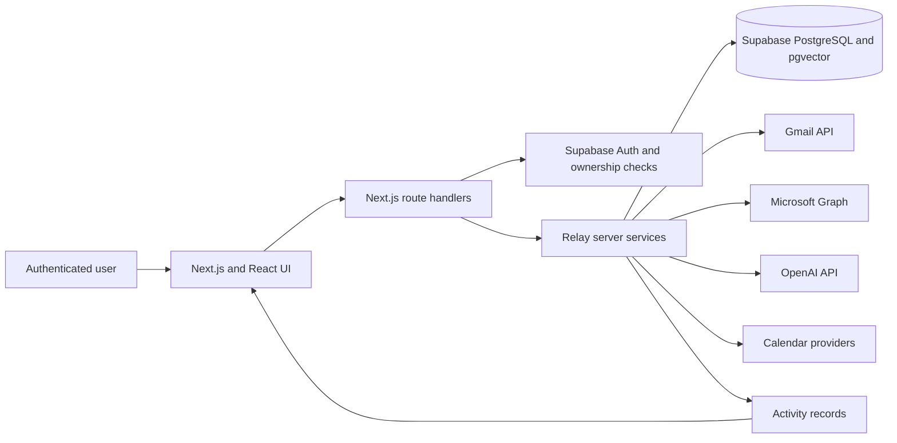
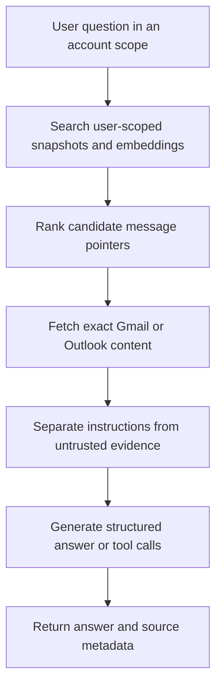
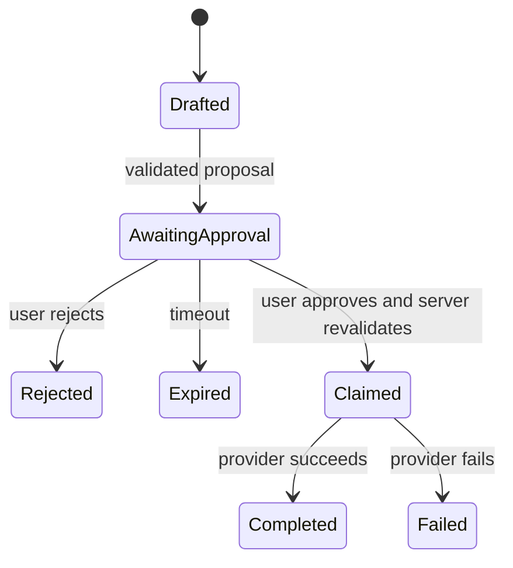

# Relay Capstone Presentation and Defence

## AI-Assisted Email, Calendar, Memory, and Agent Platform

**Course:** SED800 - Software Engineering Capstone

**Defence date:** Friday, August 14, 2026

**Team:** Dhruv Mann, Arshia Bar., Dipak Prasad, and Smeet Patel

This document contains the presentation slides, speaking guidance, live-demo script, showcase-video outline, and defence question bank. Detailed evidence and citations remain in `Relay_Capstone_Thesis_and_Defence.md`.

---

## Twenty-Five-Minute Defence Schedule

| Clock | Duration | Rubric area | Content |
| --- | ---: | --- | --- |
| 00:00-02:00 | 2:00 | Business case and scope | Problem, target users, value, objectives, included and excluded scope |
| 02:00-06:00 | 4:00 | Design and alternatives | Architecture evolution, provider abstraction, Supabase, semantic context, memory, and alternatives |
| 06:00-09:00 | 3:00 | Testing and security | Test results, coverage, CI, encryption, RLS, AI safety, activity controls, and gaps |
| 09:00-10:00 | 1:00 | Conclusion and future work | Achievements, limitations, and next priorities |
| 10:00-17:00 | 7:00 | Demonstration | Multi-account email, AI context, commitments/calendar, and activity history |
| 17:00-25:00 | 8:00 | Questions and answers | Individual answers supported by repository evidence |

The schedule totals exactly **25:00**.

---

# Presentation Slides

## Slide 1 - Relay

### On the slide

**Relay**  
AI-Assisted Email, Calendar, Memory, and Agent Platform

- Unified Gmail and Outlook workspace
- Contextual AI grounded in mailbox evidence
- Reviewable personalization memory
- Activity-tracked calendar and commitment workflows; approval executor remains future work

### Speaker notes

Relay is a communication workspace for people who manage multiple email accounts and rely on email for tasks, meetings, and follow-ups. The project combines provider integration, contextual AI, commitments, calendar operations, memory, and bounded agent actions in one full-stack application.

---

## Slide 2 - Business Problem

### On the slide

- Important context is distributed across accounts and threads.
- Deadlines and commitments are easily missed.
- General AI chat lacks private mailbox context and provenance.
- Unrestricted AI automation can perform the wrong action.

### Speaker notes

The problem is not simply that users receive too much email. The deeper problem is fragmentation: a request may be in one account, its background in another thread, and the corresponding deadline in a calendar or only in the user's memory. Copying email into a general chatbot is inefficient and can expose private information. At the same time, directly connecting an AI model to write-capable tools would create unacceptable risk.

---

## Slide 3 - Business Case and Scope

### On the slide

**Value proposition:** One workspace that helps users understand communication and prepare actions while preserving user control.

**Implemented scope**

- Gmail and Outlook accounts
- Core mailbox workflows
- AI chat, summaries, drafts, briefs, and search
- Commitments and calendar integration
- Personalization memory
- Agent activity with cancel/retry; target approval design

**Not claimed**

- Guaranteed AI correctness
- Production-scale performance
- Completed external penetration testing
- Completed formal usability or accessibility study

### Speaker notes

Relay reduces workflow switching and makes communication context easier to retrieve. The system is a security-aware capstone implementation, not a certified production email service. Being clear about that boundary is part of the project's engineering quality.

---

## Slide 4 - System Architecture

### On the slide

### Speaker notes

The browser never receives service-role keys, provider secrets, token-encryption keys, or the OpenAI key. Next.js routes authenticate the Relay user, validate requests, and establish account ownership before server services access Supabase or an external provider. Provider-specific Gmail and Outlook adapters return normalized data to shared application workflows.

---

## Slide 5 - Design Alternatives

### On the slide

| Decision | Alternative considered | Selected direction |
| --- | --- | --- |
| Application structure | Separate SPA and Express API | Next.js backend-for-frontend and modular services |
| Deployment | Microservices | Modular monolith for current scale |
| Mail data | Provider-only or full local mirror | Bounded local synchronization plus provider grounding |
| AI context | Single large prompt | Selected-thread, memory, same-contact, and semantic context |
| Agent actions | Autonomous writes | User-directed workflows now; approval-gated proposals as target design |
| Personalization | Broad knowledge graph | Scoped, reviewable memory ledger |

### Speaker notes

The alternatives were evaluated against team size, maintainability, privacy, and operational complexity. The selected designs are not universal answers. They are appropriate for this project's web-client scope and current scale. The remaining legacy Express routes are recognized technical debt and a security-hardening priority.

---

## Slide 6 - Grounded AI Retrieval

### On the slide

### Speaker notes

An embedding or snapshot is not treated as source truth. It is a pointer to a potentially relevant message. Relay fetches the exact provider message or thread before using it as evidence. If the local index is incomplete, the retrieval service can fall back to bounded Gmail or Outlook search. This improves provenance and acknowledges that local synchronization may be partial.

---

## Slide 7 - Memory and Personalization

### On the slide

- User-, account-, and contact-scoped context
- Confidence and repeated-evidence thresholds
- Sensitivity, expiry, contradiction, and activation state
- Review, edit, activate, reject, archive, or delete
- Learning failure does not block normal email workflows

### Speaker notes

Relay does not save every model inference as durable memory. Explicit low-risk preferences require high confidence. Inferred style or workflow preferences require repeated evidence. Sensitive or contradictory observations stay inactive until review. A preference associated with one contact is not automatically applied to everyone.

---

## Slide 8 - Workflow Activity and Target Approval

### On the slide

- Current: user-owned runs, events, scheduling, cancel, and retry
- Current: authenticated user-directed email and calendar routes
- Target: immutable expiring proposals, explicit approval, atomic claim, and revalidation
- Consequential model-proposed actions must remain disabled until that target is complete

### Speaker notes

The repository implements visible workflow activity and state controls, but not the full approval executor in the target diagram. Say this directly: user-directed actions are authenticated today; model-proposed consequential actions require the remaining immutable approval and revalidation work.

---

## Slide 9 - Implementation

### On the slide

**Frontend:** Next.js 16, React 19, TypeScript, Tailwind CSS  
**Backend:** Next.js route handlers and server-only services  
**Data:** Supabase Auth, PostgreSQL, RLS, and pgvector  
**Integrations:** Gmail API, Microsoft Graph, OpenAI, Google/Microsoft calendars  
**Validation:** Zod schemas  
**Testing:** Jest, React Testing Library, Playwright, ESLint, TypeScript, GitHub Actions

### Speaker notes

The application is organized around UI components, authenticated API routes, provider adapters, and shared server services. Database migrations represent accounts, email metadata, AI history, retrieval snapshots, memory, commitments, calendar links, agent runs, and activity events.

---

## Slide 10 - Testing Results

### On the slide

**Verified August 11, 2026**

- 36 Jest suites passed
- 206 Jest tests passed
- 0 snapshots

| Metric | Coverage | CI threshold |
| --- | ---: | ---: |
| Statements | 100% | 100% |
| Branches | 100% | 100% |
| Functions | 100% | 100% |
| Lines | 100% | 100% |

### Speaker notes

The tests cover units, React components, mocked API integrations, database contracts, and selected performance-regression paths. The percentages apply to Jest's configured coverage scope, not every repository file. These results do not prove live-provider reliability, production capacity, usability, or absence of vulnerabilities.

---

## Slide 11 - Security

### On the slide

**Implemented controls**

- Supabase authentication and server-owned account scope
- RLS policies and schema-contract tests
- AES-256-GCM provider-token encryption
- Input and structured-output validation
- Untrusted-email boundary for AI
- Rate and tool-call limits
- Activity ownership and state validation; approval revalidation remains a target

**Open work**

- Remove or isolate legacy Express routes
- Complete deployed two-user isolation tests
- Validate security headers, rate limits, attachments, retention, and backups
- Complete adversarial and penetration testing

### Speaker notes

The security plan is a risk-based design and testing plan, not a completed penetration-test report. Relay should not be presented as externally release-ready while critical findings remain open.

---

## Slide 12 - Results, Limitations, and Future Work

### On the slide

**Results**

- Multi-provider email and account-scoped AI
- Selected-thread and semantic personalization context
- Reviewable personalization memory
- Commitments and calendar workflow
- Complete approval-gated model actions
- Broad automated test suite

**Next priorities**

1. Close release-blocking security risks.
2. Validate migrations and two-user/two-account staging behavior.
3. Complete browser, accessibility, load, and user evaluation.
4. Add deeper source-backed personalization records.
5. Define production monitoring, retention, backup, and incident response.

### Speaker notes

Relay's strongest contribution is not a single feature. It is an architecture that treats email as evidence rather than authority, keeps memory reviewable, and keeps authorization outside the model. The honest conclusion is that Relay is a substantial capstone implementation with a credible path to deployment, not yet a certified production service.

---

# Seven-Minute Live Demonstration

## Demo Preparation

- Use an isolated test user with synthetic Gmail and Outlook messages.
- Verify both account connections, synchronization, OpenAI, Supabase, and calendar access before the defence.
- Seed one thread with a deadline, one contact with earlier correspondence, one commitment, and one safe calendar event.
- Hide notifications, secrets, personal inboxes, consoles, and environment files.
- Keep a local backup recording and labelled screenshots.

## Scripted Flow

### 10:00-10:45 - Account Scope and Unified Inbox

Show the account selector and switch among Gmail, Outlook, and the combined view. Explain that Relay unifies the workflow without erasing the account required for authorization and provider operations.

### 10:45-11:45 - Message and Thread Workflow

Open the seeded project thread. Show participants, history, attachment metadata, and standard actions. Briefly demonstrate search or cursor-based loading.

### 11:45-13:00 - Contextual AI Assistance

Ask for a summary and the next action. Show context-source disclosure, then prepare a draft reply. Emphasize that the draft has not been sent.

### 13:00-14:15 - Context and Memory

Open a selected thread and ask the thread assistant for a summary or draft that uses contact/account context. Briefly open memory settings to show inspection and correction. Do not claim generalized mailbox chat or automatic provider fallback unless that route is present in the final build.

### 14:15-15:15 - Commitment or Calendar

Track the seeded deadline or show the existing commitment and meeting brief. Open the agenda and explain how Relay turns communication evidence into explicit follow-up.

### 15:15-16:30 - Activity-Tracked Action

Create or update a team-controlled calendar/commitment item and show its activity record. Demonstrate eligible cancellation or retry if stable. Explain that immutable approval and revalidation for model-proposed writes is the documented next security step.

### 16:30-17:00 - Close

Show the activity result and summarize the path: multiple providers, grounded context, reviewable memory, action tracking, and bounded authority.

## Demo Contingency Ladder

1. If OpenAI is slow, use an already generated response and explain its sources.
2. If one provider fails, demonstrate the other and use prepared screenshots for provider abstraction.
3. If OAuth expires, switch to the backup account rather than repairing credentials live.
4. If the deployment fails, play the seven-minute backup recording.
5. Keep images of the architecture, ER diagram, coverage, inbox, assistant, memory review, commitment, and activity result.

---

# Ten-Minute Showcase Video

| Clock | Duration | Required topic | Narration goal |
| --- | ---: | --- | --- |
| 00:00-01:00 | 1:00 | Business case | Show account switching and missed follow-ups; introduce Relay's value |
| 01:00-01:45 | 0:45 | Scope | Explain what Relay does and does not claim |
| 01:45-03:45 | 2:00 | Technical discussion | Explain provider connections, protected storage, scoped AI context, memory, and workflow safety |
| 03:45-04:30 | 0:45 | Future work | Cover security closure, validation, accessibility, and personalization |
| 04:30-09:30 | 5:00 | Demonstration | Show account scope, summary, draft, commitment/calendar, and activity |
| 09:30-10:00 | 0:30 | Closing | Restate one workspace, relevant context, and user control |

## Suggested Non-Technical Opening

> Important work often begins in an email, but the deadline, earlier context, calendar event, and reply may all live in different places. Relay brings Gmail and Outlook into one workspace and helps the user understand and act on that information. Its AI uses bounded, user-scoped context; completing approval-gated model actions is prioritized future work.

Translate technical terms for the showcase audience: use "meaning-based search" for embeddings, "database rules that keep users separate" for RLS, "duplicate-action protection" for idempotency, and "email formatting" for MIME.

---

# Speaker Responsibilities

| Segment | Suggested lead | Supporting responsibility |
| --- | --- | --- |
| Opening, business case, scope, conclusion | Dhruv | Keep time and connect the system to project objectives |
| Retrieval, AI context, and agent behavior | Arshia | Explain grounding, hallucination limits, and prompt injection |
| Data model, RLS, security, and privacy | Dipak | Explain ownership, encrypted credentials, risks, and evidence limits |
| Interface and live demonstration | Smeet | Demonstrate responsive workflows and UI behavior |
| Q&A | All members | Answer in the responsible area, then invite concise additions |

Every member should understand the complete architecture. For each answer, state the decision, reason, evidence, and limitation. Each member should prepare two concrete pull requests or commits, one technical challenge, and one lesson learned.

---

# Defence Question Bank

## Business Case and Scope

1. **Why does Relay need to exist when Gmail and Outlook already have AI features?**  
   Relay's contribution is a provider-neutral workflow connecting mail, grounded retrieval, commitments, calendar, memory, and controlled actions. It does not claim to replace every provider feature.

2. **Who is the target user?**  
   A person managing multiple mailboxes or relying on email for tasks and follow-ups, particularly individuals and small teams.

3. **What measurable business benefit did you prove?**  
   The implementation demonstrates workflow consolidation, but no controlled productivity study is verified. Do not claim time savings without user evidence.

## Architecture and Alternatives

4. **Why Next.js rather than a separate React and Express deployment?**  
   It shares authentication, types, and deployment with the web client and reduces CORS and operational complexity. A separate API may be justified later for multiple client types.

5. **Why not use microservices?**  
   Current scale does not justify distributed identity, tracing, deployment, and consistency overhead. The modular services can be extracted later if measurements justify it.

6. **Why store email data locally?**  
   Local metadata and snapshots improve responsiveness and retrieval, while exact provider fetching restores freshness and provenance. This adds retention and deletion responsibility.

7. **Why PostgreSQL instead of MongoDB?**  
   Relay has strongly related user-owned entities and benefits from constraints, transactions, foreign keys, RLS, and vector support in one system.

8. **Why not use a full knowledge graph?**  
   A broad inferred graph makes provenance, privacy, and correction harder. The implemented memory ledger is scoped and reviewable.

## AI, Retrieval, and Memory

9. **How does Relay reduce hallucination?**  
   It retrieves bounded evidence, fetches exact provider messages, exposes source metadata, and validates structured outputs. It reduces but cannot eliminate hallucination.

10. **Why are embeddings not the source of truth?**  
    Similarity only suggests relevance. Relay uses matches as pointers and fetches the exact message before grounding an answer.

11. **How do you prevent one contact's style from affecting another?**  
    Context is scoped by user, account, and contact. Contact-specific evidence is not automatically promoted to a global preference.

12. **What happens if OpenAI is unavailable?**  
    AI features fail softly; ordinary reading and sending should continue without embeddings or generation.

13. **How can users correct memory?**  
    They can inspect, edit, activate, reject, archive, or delete it. Inactive, expired, contradicted, or sensitive unreviewed memories do not influence prompts.

## Testing and Security

14. **What did the 206 tests prove?**  
    They prove the configured logic and mocked integrations across 36 Jest suites. The 100% result applies only to the configured core-module instrumentation, not every production file, live provider, performance, usability, or absence of vulnerabilities.

15. **Does the coverage number include the entire repository?**  
    No. It applies to Jest's configured coverage scope and should not be generalized beyond it.

16. **How are OAuth tokens protected?**  
    They remain server-side and are encrypted with AES-256-GCM. API responses exclude them. Production key management and rotation still require operational controls.

17. **How is user isolation enforced?**  
    The server authenticates the user, resolves account ownership, filters data operations, and uses database RLS as defense in depth.

18. **Can a malicious email control the agent?**  
    Email is treated as untrusted data, ownership is resolved server-side, and structured outputs are validated. The full bounded tool and approval executor remains a target, so consequential model-proposed writes must not be enabled yet.

19. **What will prevent approval replay?**  
    The target design uses user ownership, expiry, an immutable input hash, atomic claiming, idempotency, and revalidation. The baseline activity layer does not yet complete that execution path.

20. **What is the most serious unresolved security issue?**  
    Removal or isolation of legacy Express OAuth/email routes, followed by destination validation and consistent route hardening.

## Project Management and Limitations

21. **How did the design change over time?**  
    It progressed from email foundations through Gmail sync, testing, account-scoped AI, Outlook, actions, calendar/commitments, memory, retrieval, and security planning.

22. **What would you cut if the schedule became shorter?**  
    Broad computer-use and deep personal-record inference should be deferred before core mailbox, isolation, testing, or approval safety.

23. **What would you do differently?**  
    Define the provider-neutral model and trust boundaries earlier, maintain stronger requirements traceability, and build controlled staging accounts alongside integrations.

24. **Is Relay production ready?**  
    Production readiness is not established. Security closure, live isolation, final CI/browser evidence, load testing, accessibility, operations, and user evaluation remain.

25. **What did each member contribute?**  
    Answer with verified pull requests, modules, tests, design decisions, and challenges rather than repeating only the role title.
