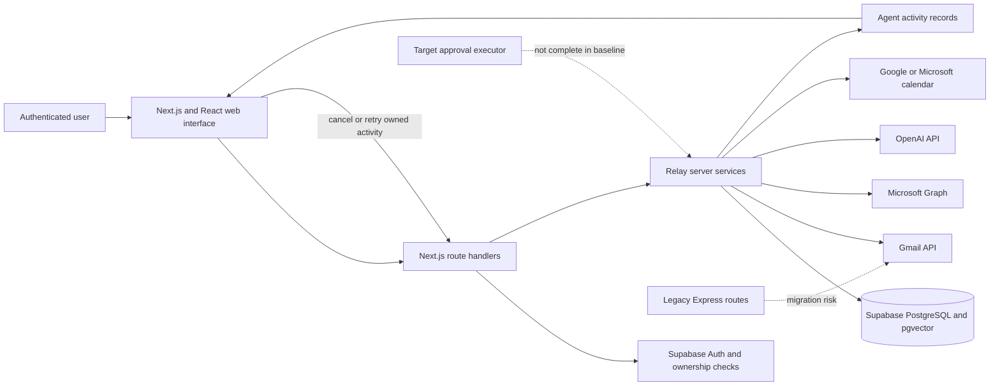
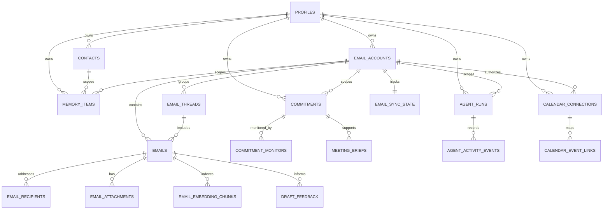
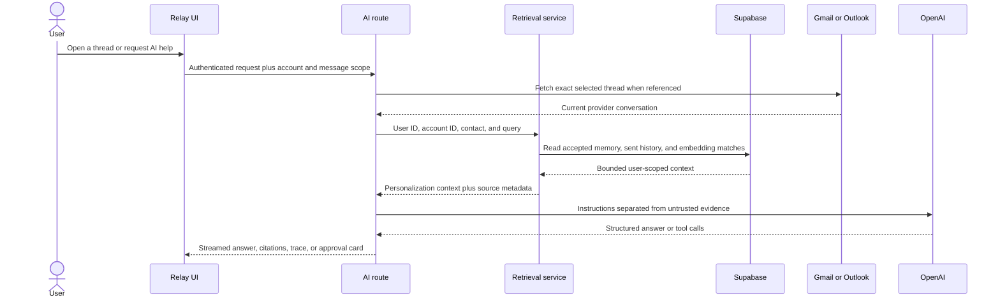
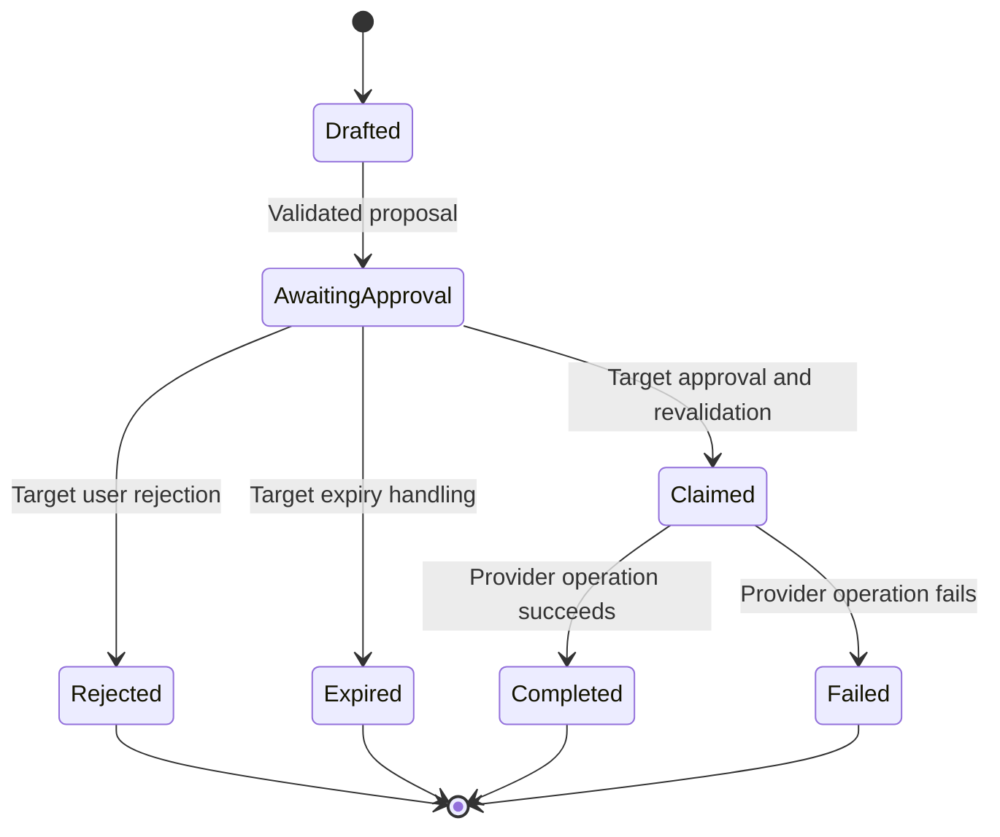

# Relay: AI-Assisted Email, Calendar, Memory, and Agent Platform

## Capstone Project Thesis

**Course:** SED800 - Software Engineering Capstone

**Institution:** Seneca Polytechnic

**Submission date:** August 14, 2026

**Implementation and test baseline:** Working tree reviewed August 11, 2026

| Team member | Project role |
| --- | --- |
| Dhruv Mann | Project manager; backend testing, integration testing, and CI/CD |
| Arshia Bar. | Retrieval-augmented generation and AI workflow testing |
| Dipak Prasad | Data analysis, security testing, and infrastructure validation |
| Smeet Patel | Frontend development, UI verification, and accessibility testing |

---

## Abstract

Email remains essential to professional communication, yet users increasingly divide their attention among multiple accounts, calendars, action items, and AI tools. This capstone presents Relay, a full-stack web application that combines Gmail and Outlook access with contextual AI assistance, calendar integration, commitment tracking, personalization memory, and activity-tracked workflows. Relay uses a React and Next.js interface, server-side route handlers, Supabase authentication and PostgreSQL storage, provider APIs, and OpenAI models. Its implemented context path combines exact selected threads, account preferences, accepted memories, same-contact sent mail, and user-scoped embedding chunks. Its workflow foundation records scheduled and completed calendar or commitment work, while a generalized approval-gated model tool executor remains part of the target design rather than the verified baseline. Evaluation found 36 Jest suites containing 206 tests passing on August 11, 2026. Statements, branches, functions, and lines each reached 100% within the configured core-module coverage scope. These results demonstrate substantial automated verification but do not establish production scalability, usability, or penetration-test readiness. Relay shows how a unified communication assistant can combine provider data with inspectable, user-scoped context. Future work prioritizes approval completion, security closure, controlled user evaluation, performance benchmarking, and accessibility validation.

**Keywords:** unified email, Gmail, Outlook, retrieval-augmented generation, AI agent, personalization memory, OAuth 2.0, Supabase, human approval, software security

---

## Table of Contents

1. [Introduction](#1-introduction)
2. [Background and Literature Review](#2-background-and-literature-review)
3. [System Design and Architecture](#3-system-design-and-architecture)
4. [Alternative Designs](#4-alternative-designs)
5. [Implementation](#5-implementation)
6. [Testing and Evaluation](#6-testing-and-evaluation)
7. [Security](#7-security)
8. [Results and Discussion](#8-results-and-discussion)
9. [Conclusion and Future Work](#9-conclusion-and-future-work)
10. [References](#references)
11. [Appendices](#appendices)

---

# 1. Introduction

## 1.1 Context and Motivation

Email clients are no longer simple message viewers. A user may need to monitor personal Gmail, organizational Google Workspace, Microsoft 365, or Outlook.com accounts while also extracting deadlines, preparing meetings, updating a calendar, and deciding which messages deserve attention. The underlying information is distributed across providers and conversation threads. Conventional search can find matching words but does not automatically explain why a message matters, connect it to an earlier commitment, or prepare a contextual response. General-purpose AI chat can help with writing, but copying private mail into an unrelated chat creates friction, weak provenance, and security concerns.

Relay addresses this coordination problem. It is intended to provide one workspace for connected Gmail and Outlook accounts and to place AI assistance beside the user's actual communication workflow. Its implemented capabilities include account-scoped mail access, inbox and thread views, provider search, drafts, sending and mailbox modifications, thread assistance, inbox and meeting briefs, calendar operations, commitment tracking, configurable model settings, chat-session persistence, reviewable memory, semantic email chunks, and visible activity history. The name *Relay* reflects the product's role: information moves from provider mailboxes into a controlled user context, through analysis and review, and into user-directed work.

The business case is based on reduced coordination cost. A user who can inspect multiple accounts, find relevant context, draft a response, and track a commitment without switching applications spends less time reconstructing what happened. A support worker or project coordinator can reduce missed follow-ups. A student or small team can turn messages into explicit commitments rather than relying on memory. The system does not claim that AI can replace user judgment. Instead, its value proposition is to make communication context more accessible while reserving consequential actions for the authenticated user.

## 1.2 Problem Statement

The project addresses three related problems:

1. **Fragmentation:** mail, calendars, reminders, and contextual knowledge are separated by provider and interface.
2. **Context loss:** relevant history may be buried in threads or absent from an AI prompt, causing generic or unsupported responses.
3. **Unsafe automation:** an AI system with direct access to private email and write-capable tools can misinterpret instructions, cross account boundaries, or act on hostile content embedded in a message.

The engineering problem is therefore not merely to add a chatbot to an inbox. Relay must unify heterogeneous provider data, retrieve the right user-scoped evidence, maintain useful but correctable memory, and enforce a boundary between AI suggestions and user-authorized actions.

## 1.3 Objectives

The capstone objectives are to:

- provide a responsive web interface for connected Gmail and Outlook accounts;
- support core mail activities, including synchronization, search, reading, drafting, sending, archiving, trashing, and attachments where implemented;
- provide contextual AI functions such as thread summaries, questions, draft replies, inbox briefs, and global mailbox chat;
- retrieve relevant mailbox context without assuming that the local cache is complete;
- isolate data and preferences by authenticated user and, where appropriate, by connected account and contact;
- record explicit or sufficiently supported personalization memories while quarantining sensitive, uncertain, expired, or contradictory observations;
- track commitments, calendar events, background monitors, and meeting briefs;
- require review and approval before high-impact agent actions;
- validate important behavior using automated unit, component, integration, contract, performance-regression, and browser tests; and
- document limitations honestly enough to support a defensible release decision.

## 1.4 Stakeholders

Primary stakeholders are people managing more than one mailbox or using email as a source of tasks and commitments. Secondary stakeholders include project teams, support personnel, small organizations, and maintainers who must operate the application. Mail providers, Supabase, OpenAI, and deployment infrastructure are external dependencies rather than project owners. Because Relay processes private messages and credentials, data subjects and security reviewers are also important stakeholders even when they do not directly operate the application.

## 1.5 Scope

The implemented scope covers a web application, provider connections, authenticated server routes, mailbox synchronization and retrieval, AI-assisted workflows, account preferences, calendar connections, commitments, memory, and supporting database structures. The repository also contains computer-use scaffolding, but the thesis does not present broad autonomous browser control as a completed production capability.

The following are outside the demonstrated baseline:

- independent operation of Google, Microsoft, Supabase, OpenAI, or hosting infrastructure;
- a native mobile application;
- enterprise administration, legal-discovery, or records-management features;
- guaranteed correctness of model-generated content;
- verified production-scale capacity or availability;
- a completed external penetration test;
- a completed formal accessibility audit; and
- statistically meaningful usability conclusions.

These exclusions prevent the project from claiming more than its evidence supports. They also frame future work.

## 1.6 Development Approach and Project-Plan Correlation

Repository history shows iterative development rather than a single release. The project began with backend and user-interface foundations, then added Gmail retrieval and synchronization, test coverage, account-scoped AI, Outlook support, activity-tracked workflows, calendar and commitment features, model settings, chat history, memory architecture, semantic retrieval, security planning, and additional UI refinement. The repository [1], Relay changelog [2], pull-request history, and public-ready System Design Document [21] provide an auditable record of this evolution.

| Period or milestone | Evidence of change | Effect on project scope |
| --- | --- | --- |
| Initial foundation | Backend and interface setup | Established the application shell and early mail workflow |
| Gmail integration | Gmail sync, categories, and attachments | Replaced a generic relay-request concept with real mailbox integration |
| Quality milestone | Jest, Playwright, schema contracts, and CI | Made testability and regression protection explicit requirements |
| AI and account scope | Contextual AI, per-account settings, multi-account UX | Expanded the product from an email client to an AI-assisted workspace |
| Outlook integration | Microsoft identity and Graph mail support | Required a provider-neutral account and message model |
| Agent workflow foundation | Activity records, commitments, calendar, cancellation, and retry | Added visible, user-owned workflows; generalized approval execution remained incomplete |
| Memory and retrieval | Memory ledger, embedding chunks, same-contact context, and selected-thread grounding | Added personalization and semantic recall with source and privacy rules |
| Security planning | Threat inventory, release criteria, remediation priorities | Identified controls that must be completed before external deployment |

## 1.7 Thesis Organization

Chapter 2 establishes the technical and research background. Chapters 3 and 4 explain the selected architecture and alternatives. Chapter 5 describes implementation, followed by testing in Chapter 6 and security in Chapter 7. Chapter 8 interprets the verified results and limitations. Chapter 9 concludes and prioritizes future work. The appendices map requirements to evidence, summarize interfaces and data, and define the terminology used throughout the thesis.

---

# 2. Background and Literature Review

## 2.1 Unified Email and Provider APIs

Gmail and Outlook expose related user concepts but different APIs, identifiers, categories, authentication details, and synchronization behavior. Google's Gmail API is a REST interface for authorized mailbox access, message sending, organization, and other mail operations [9]. Microsoft Graph similarly provides authorized access to Outlook mail for personal and organizational accounts and models messages inside mail folders [11]. A unified client cannot simply rename fields. It needs a provider abstraction that preserves provider identifiers, account ownership, pagination or sync cursors, thread relationships, and provider-specific operations.

Relay therefore treats the connected account as a first-class scope. Email rows include their provider and account relationship. Gmail-specific categories are not assumed for Outlook messages. Provider adapters fetch or modify remote state, while shared application services present a common view to the interface. This design follows the product requirement that a user can interact with more than one provider without losing the distinction between accounts.

## 2.2 OAuth and Delegated Access

OAuth 2.0 defines a framework in which a resource owner can authorize a client to access a protected service without giving the client the owner's password [12]. Gmail web-server authorization exchanges a one-time authorization code for tokens that the server can use on the user's behalf [10]. Microsoft identity uses a comparable delegated authorization model for Graph.

For Relay, OAuth is both an integration mechanism and a security boundary. Access and refresh tokens represent mailbox authority. They must remain server-side, be encrypted at rest, be associated with the correct Relay user and provider account, and never appear in browser-visible URLs or API responses. State values must be integrity protected and expire. Requested scopes should be no broader than the supported functionality. Disconnecting an account should revoke or delete stored authority where the provider permits it.

## 2.3 Component-Based Full-Stack Web Development

React organizes interfaces as reusable components [6]. Relay applies this model to its shell, account selector, mailbox lists, thread and compose views, assistants, calendar, commitments, activity, settings, and responsive navigation. Next.js App Router adds file-system routing and route handlers within `app` [7], allowing the application to act as its own backend-for-frontend. This fits authorization and provider operations tied to the web client. A remaining Express server is treated as migration and security debt, not the desired public architecture.

## 2.4 Relational Storage, Row-Level Security, and Vectors

Relay stores user, account, message, AI, memory, commitment, and calendar metadata in PostgreSQL through Supabase. Relational constraints suit entities with clear ownership and cross-references. Supabase combines PostgreSQL with authentication and an API layer. Its documentation emphasizes enabling Row Level Security (RLS) on exposed tables and using policies to restrict rows according to the authenticated user [8]. Relay's schema enables RLS across user-owned tables and includes contract tests that inspect ownership policies and constraints.

Vector representations support semantic similarity rather than exact keyword matching. Relay stores user- and account-scoped `email_embedding_chunks` and uses a PostgreSQL matching function for selected AI context. Exact selected threads are obtained from the provider-facing thread path. The reviewed baseline does not contain the generalized `email_context_snapshots` service described in the broader design notes, so automatic semantic-candidate grounding and provider fallback remain an evolution target rather than a completed claim.

## 2.5 Retrieval-Augmented Generation

Retrieval-augmented generation combines a language model with external, non-parametric information. Lewis et al. showed that retrieved evidence can improve knowledge-intensive generation and make knowledge easier to update than relying on model parameters alone [14]. Relay applies the broad idea to private mailbox context rather than a public encyclopedia. The retrieval problem includes additional constraints: every result belongs to a user and account; email is untrusted; local content may be incomplete; and the result may influence a consequential action.

Relay's implemented context assembly combines accepted memory, account preferences, same-contact sent mail, and optional semantic matches from `email_embedding_chunks`. Thread-specific AI routes receive the exact selected provider thread. A separate search route queries Gmail or Outlook and caches normalized metadata. The intended next step is to combine these paths into one generalized retrieval service that automatically grounds semantic candidates and falls back to provider search when local coverage is weak. Embedding failures are already soft failures, so ordinary reading and sending do not depend on the AI service.

## 2.6 Personalization Memory

A useful assistant should remember stable preferences, but indiscriminate memory creates privacy and correctness risks. Relay separates account settings, recent context, contact metadata, email evidence, and durable memory items. Explicit low-risk preferences may become active at a high confidence threshold. Inferred preferences require repeated evidence. Sensitive, secret-like, contradictory, or uncertain material is quarantined or kept inactive until review. The user can inspect, edit, activate, reject, archive, or delete learned memory.

This design is intentionally more conservative than storing every model inference. Durable memory includes source and state metadata, and only active, unexpired, non-contradicted records should influence prompts. Contact-specific tone is not generalized to every recipient. Generated-versus-final draft feedback is recorded only after provider send succeeds, preventing failed sends from being treated as confirmed user behavior. The Relay memory architecture [4] documents this trust-oriented learning loop.

## 2.7 AI Agents and Human Oversight

OpenAI's Responses API can combine model output with defined tools [13]. Tool access turns a conversational model into an agent capable of reading external state or proposing changes. That capability creates a confused-deputy problem: an email can contain hostile instructions, but the email sender is not authorized to control the recipient's agent.

NIST frames trustworthy AI as a lifecycle risk-management responsibility rather than a one-time model decision [15]. OWASP guidance identifies direct and indirect prompt injection, tool manipulation, data exfiltration, context poisoning, and memory poisoning as important risks [16], [17]. Recommended controls include separating instructions from data, validating tool arguments, least privilege, structured outputs, memory isolation, limits on tool chaining, and human review for high-impact actions. Relay already labels provider content as untrusted, injects ownership server-side, validates structured AI outputs, and scopes personalization records. Its target design additionally requires a complete approval executor before model-proposed sending, deleting, unsubscribing, or calendar changes may be described as safely authorized. A model proposal is not authorization.

## 2.8 Existing-System Gap

Provider clients, general AI assistants, task managers, and calendars each solve part of the problem. Relay's contribution is their controlled integration: provider adapters preserve source truth, retrieval supplies bounded evidence, memory remains reviewable, and authorization remains outside the model. It does not claim to outperform every specialist product. Section 1.6 shows how this pattern emerged through implementation and testing.

## 2.9 Requirements Baseline and Evolution

The original project plan defined thirteen functional requirements and six non-functional requirement groups. During implementation, the team retained the business goal but changed the primary web architecture, narrowed unsupported claims, and added memory, commitments, activity history, and meeting briefs. The public-ready System Design Document [21] records the same baseline and design rationale. In the tables below, **implemented** means repository code and automated evidence exist, **partial** means a usable foundation exists but an important planned behavior or live validation remains, and **unverified** means the requirement is still a target without sufficient baseline evidence.

### Functional requirement evolution

The final product fully implements the provider connection, multi-account, synchronization, unified inbox, thread, summary, draft, and embedding-storage requirements. Search/RAG, generic agent proposals, universal confirmation, and deployed RLS verification remain partial. The most important changes were replacing webhook dependencies with cursor-based pulls, separating provider search from semantic personalization, and delivering concrete calendar/commitment activity before a generalized approval executor. Appendix A provides the row-by-row original-versus-final table.

The non-functional requirements evolved in equally important ways. Security and reliability gained concrete controls but still need deployed evidence. The original search-under-two-seconds and summary-under-five-seconds targets remain unverified. The modular-monolith and multi-account foundations are implemented, while capacity is unmeasured. Privacy was clarified because authorized OpenAI processing conflicts with the original “never shared with third parties” wording. Responsive usability is implemented, but accessibility and user outcomes are not formally evaluated. Appendix A provides the complete non-functional evolution table.

---

# 3. System Design and Architecture

## 3.1 Design Goals

The design prioritizes user/account isolation, provider neutrality, inspectable context, graceful AI failure, and maintainability. Exact provider data is preferred to stale inference, consequential writes are reviewable, and shared services centralize authorization and normalization.

## 3.2 High-Level Architecture

The browser is untrusted and receives only data intended for the signed-in user. Next.js routes authenticate the session, validate inputs, resolve account ownership, and call server-only services. Those services interact with Supabase, providers, and OpenAI. Service-role credentials, provider tokens, encryption keys, OAuth secrets, and the OpenAI key remain server-side. The legacy Express layer is shown separately because it is not the desired public trust boundary.

## 3.3 Major Components

| Component | Responsibility | Principal inputs | Principal outputs |
| --- | --- | --- | --- |
| Application shell and mailbox UI | Navigation, account scope, mail lists, reading, composing, responsive layout | Session, account selection, API responses | User interactions and authenticated requests |
| Authentication and account services | Validate Relay identity, OAuth state, provider ownership, and token lifecycle | Bearer session, OAuth callback, account ID | Authenticated user and usable provider client |
| Gmail and Outlook adapters | Normalize provider-specific fetch, sync, thread, draft, send, and modification behavior | Account-scoped provider IDs and operations | Normalized message data or provider result |
| AI routes and context assembly | Build prompts, select account/contact context, validate structured results | User request, thread references, settings, retrieved context | Summary, answer, draft, brief, or tool proposal |
| Mailbox context | Combine exact selected thread, same-contact history, accepted memory, and semantic chunks | User/account, selected message, query, optional contact | Bounded contextual evidence and source descriptors |
| Personalization and memory | Assemble preferences and learn reviewable observations | Explicit settings, accepted memory, successful send feedback | Bounded personalization context and memory items |
| Workflow activity | Record scheduled or executed calendar, commitment, monitor, and brief work | Authenticated workflow request and validated input | Activity state, event history, result, cancellation, or retry |
| Commitments and calendar | Track obligations, reminders, monitors, events, and meeting briefs | User actions and selected email evidence | User-owned commitments, events, and briefs |
| Target approval executor | Proposed extension that would bind a reviewed payload to later execution | Immutable proposal, expiry, user decision | Approved execution, rejection, expiry, or failure record |

## 3.4 Data Design

The relational schema groups identity/preferences, provider mail, AI/retrieval, memory, agent activity, commitments, and calendar data. Provider identifiers remain beside normalized records so Relay can return to source truth. User-owned rows carry `user_id` or derive ownership through a parent. Foreign keys and uniqueness constraints reduce duplication, while RLS reinforces server authorization. Because the service role can bypass RLS, routes must still authenticate users and filter by ownership. Figure 3.2 presents the core entity relationships; Appendix C lists additional supporting tables.

**Figure 3.2. Core logical ER diagram.** Authentication users are represented by profile ownership; provider credentials are stored only on `email_accounts` and `calendar_connections`. The diagram omits settings and several auxiliary tables for readability.

## 3.5 Retrieval and Context Flow

This implemented flow limits context to an authenticated account and keeps provider content in the role of evidence rather than system instruction. The exact selected thread and semantic context are separate inputs; a future generalized retrieval service should re-fetch every semantic candidate before treating it as current evidence. The UI can disclose source categories without exposing unrelated raw message bodies.

## 3.6 Workflow State and Target Approval State

The state diagram is the **target** approval design. The current baseline implements user-owned `agent_runs`, `agent_activity_events`, scheduled/running/completed/failed/cancelled states, idempotency fields, and authenticated cancel/retry operations. It does not yet implement the complete `approve -> claim -> immutable-payload revalidation -> execute` path shown above. Completing that path is required before Relay can claim that every consequential model-proposed action is approval-gated.

## 3.7 Deployment Design

The repository combines a Next.js application, a legacy Express process, and a scheduled commitment job. Supabase, Gmail, Microsoft Graph, OpenAI, and calendar systems are external services. Environment variables keep service-role, provider, encryption, cron, and OpenAI secrets server-side. CI targets Node.js 22 with quality, browser, and security jobs. The deployment boundary is intentionally a modular monolith: one primary web deployment owns session-aware routes and server services, while scheduled work calls a secret-protected job endpoint. The legacy Express process must be removed or made private before public release.

## 3.8 Design Evolution

The original design described a React SPA, a separate Express API gateway, Gmail watch notifications, Microsoft Graph webhooks, OpenAI or Anthropic models, and a generic approval-driven agent layer. Implementation evidence shows a different and more focused architecture.

| Design concern | Original design | Implemented end-product design | Reason and consequence |
| --- | --- | --- | --- |
| Web boundary | React SPA plus independent Express REST API | Next.js App Router combines React pages with authenticated route handlers; legacy Express remains migration debt | Reduced CORS, deployment, session, and duplicated-routing complexity |
| Provider synchronization | Gmail `watch`/`history.list`; Graph webhooks/delta | Gmail history-based incremental pulls and Outlook delta/next-link pulls | Avoided webhook infrastructure during the capstone while preserving incremental cursors |
| AI providers | OpenAI and Anthropic | OpenAI Responses and Embeddings APIs | Reduced adapter and evaluation scope; multi-provider support remains future work |
| Search | Database FTS plus vectors | Direct Gmail/Outlook provider search plus semantic embedding matches for AI context | Delivered provider-accurate search; unified local FTS/vector experience remains partial |
| RAG | Message/attachment embeddings with generalized citation pipeline | Same-contact sent mail, accepted memory, selected exact thread, and message embedding chunks | Narrowed retrieval to evidence supported by code; attachment RAG and automatic grounding remain future work |
| Agentic actions | Generic tool proposals for labels, calendar, and follow-ups with confirmation | Commitments, calendar actions, monitors, meeting briefs, activity records, cancel/retry | Shipped concrete workflows first; full approval executor remains incomplete |
| Data model | Core users/accounts/threads/messages plus embeddings/tasks | Expanded provider-neutral schema with recipients, drafts, memory, feedback, commitments, calendars, briefs, activity events, and settings | Product scope expanded from inbox/RAG into a communication workspace |
| Privacy model | “User data never shared with third parties” | Minimized, server-controlled context is sent to the configured OpenAI service | Corrected an incompatible requirement and made third-party AI processing explicit |

The complete public-ready design description is maintained in `docs/Relay_System_Design_Document.tex` [21].

---

# 4. Alternative Designs

## 4.1 Separate SPA and Express API Versus Next.js Backend-for-Frontend

A conventional option was a React single-page application with an independent Express REST API. This separation can support multiple clients and independent scaling. It also creates two deployment units, a broader CORS surface, duplicated routing conventions, and more opportunities to pass tokens between browser and service. Relay's early backend work and remaining Express server reflect this direction.

The selected direction places the user-facing API in authenticated Next.js route handlers. UI and server boundaries remain distinct in code, but share types, deployment, and session conventions. This is simpler for a capstone team and fits the backend-for-frontend use case. It is not a claim that monolithic deployment is universally superior. If Relay later supports mobile or third-party clients, a separate versioned service API may become appropriate. For the current web application, the residual Express routes should be removed or network-isolated because they complicate the trust model.

## 4.2 Modular Monolith Versus Microservices

Microservices could isolate synchronization, AI, calendar, and memory workloads and scale them independently. They would also require service authentication, distributed tracing, message delivery, deployment automation, and operational maturity that exceed the capstone's demonstrated needs. Most user operations share identity and account scope, making premature distribution a source of risk.

Relay therefore uses a modular monolith: UI routes, API routes, and server services are separate modules inside one primary application. Background commitment processing is logically separate and cron-authenticated. The design can later extract synchronization or long-running AI work if measurements justify it. Extraction should follow observed capacity or reliability limits, not fashion.

## 4.3 Provider-Only Access Versus Local Synchronization

A provider-only design would fetch every view directly from Gmail or Outlook. It minimizes local copies but increases latency, rate-limit exposure, and provider-specific branching. A full mirror improves search and offline analysis but expands retention, deletion, and consistency obligations.

Relay chooses bounded synchronization plus provider grounding. Local metadata, snapshots, and selected excerpts enable responsive listing and retrieval. Exact provider content is fetched when a result must support an answer or action. This hybrid approach accepts complexity in exchange for speed and provenance. Retention and deletion still require operational verification.

## 4.4 Single-Shot AI Versus Retrieval and Tools

A single completion request containing the current thread is easy to implement. It performs poorly when relevant context lies elsewhere and cannot safely manipulate mailbox state. Sending a very large mailbox context would increase cost and privacy exposure.

Relay selected task-specific structured outputs and bounded, user-scoped context instead of sending an entire mailbox to one completion. The implemented routes produce summaries, drafts, briefs, and personalization results. A generalized multi-round tool runtime with enforced read/write budgets was designed but is not present in the reviewed baseline. This separation prevents the thesis from treating a target design as completed implementation.

## 4.5 Autonomous Writes Versus Approval-Gated Actions

Direct autonomous writes would create a smoother interaction but an unacceptable authorization model for private communication. A malicious email, ambiguous request, or model error could send a message or alter a calendar without informed consent. Relay's target design separates preparation from execution: read-only assistance and drafts can be returned immediately, while high-impact actions become expiring approval records. The current baseline has user-owned activity state, idempotency metadata, calendar/commitment workflows, and cancel/retry controls, but the generic approval-and-execute path is incomplete. This remains the selected security direction because it aligns control with consequence.

## 4.6 Knowledge Graph Versus Scoped Memory Ledger

A broad knowledge graph could represent people, organizations, projects, threads, and inferred relationships. It would support multi-hop reasoning but would also make inference provenance, correction, and sensitive-data control more difficult. The implemented choice is a scoped memory ledger combined with contacts, snapshots, explicit relational records, and retrieval. Memories have status, scope, confidence, evidence, sensitivity, expiry, and contradiction information. A lightweight graph remains future work for source-backed, reviewable relationships only.

---

# 5. Implementation

## 5.1 Technology Stack and Strategy

Relay is written primarily in TypeScript. The reviewed `package.json` specifies Next.js 16.2.6, React 19.2.0, Supabase JavaScript 2.107.0, Express 5.2.1, Zod 3.25.76, Tailwind CSS 4, Jest 29, and Playwright 1.61.0. Development proceeded iteratively through feature branches and pull requests. The stack supports shared types, component testing, server-side provider clients, and schema-validated AI outputs.

The implementation strategy separates browser components from server-only modules. The `app` directory contains pages and route handlers. Reusable UI resides in `components`. Provider, authentication, AI, personalization, memory, commitment, calendar, encryption, and activity logic resides under `lib/server`. Supabase SQL defines the target schema and incremental migrations. Tests are grouped by contract, unit, integration, performance, and end-to-end scope. Low-level responsibilities and interfaces are also recorded in the public-ready System Design Document [21].

## 5.2 Frontend Implementation

The interface uses desktop and mobile navigation, with account selection establishing mailbox and AI scope. Shared modules support inbox, sent, drafts, archives, trash, thread, search, and compose views. Assistants expose summaries, questions, tasks, briefs, and drafts beside relevant messages. Other pages cover chat history, activity, calendar, commitments, meeting briefs, and settings. Chat can stream answers, sources, tool status, clarification, drafts, and approval cards, making workflow state visible.

Responsive components and mobile navigation support smaller screens. DOMPurify is available for sanitizing rendered HTML. However, the existence of responsive code and sanitization libraries is not equivalent to a completed accessibility or cross-browser audit. Those claims require manual evidence.

## 5.3 Authentication and Provider Accounts

Relay users authenticate through Supabase. Server routes validate the bearer session and derive the trusted user identifier rather than accepting ownership from the model or request body. Gmail and Outlook OAuth callbacks associate encrypted provider credentials with an `email_accounts` row. The provider account includes its type, provider identity, token expiry, and sync state.

Gmail services parse metadata and MIME content, handle attachments, create drafts, send mail, and apply mailbox changes. Outlook services use Microsoft Graph for equivalent supported operations and normalize their results. A provider-neutral email API lets components request messages without implementing two complete clients. Provider-specific constraints remain visible; for example, Gmail categories are not applied to Outlook-only inboxes.

Token encryption uses AES-256-GCM with a fresh initialization vector and authentication tag. OAuth state is encrypted and carries issuance information so expired state can be rejected. A compatibility path can read legacy plaintext tokens, which is useful for migration but should be eliminated after all stored credentials are re-encrypted.

## 5.4 Mail Synchronization, Search, and Attachments

Synchronization stores account-scoped message/thread metadata and provider cursors, with constraints against duplicate messages and drafts. Recipients, attachments, and labels are normalized. Cursor pagination avoids loading a mailbox at once. HTML, plain text, and attachments remain untrusted. Performance tests guard parsing and encoding regressions but are not capacity benchmarks; live sync at meaningful mailbox sizes remains planned.

## 5.5 Contextual AI

Server-side OpenAI integration supports structured generation for thread summaries, extracted tasks, draft replies, inbox briefs, and meeting support. Chat-session tables and routes persist conversation metadata, but the reviewed baseline does not expose the generalized mailbox-chat agent route described in the broader product vision. Zod schemas constrain request and model-response shapes. Model settings and per-account preferences allow users to select enabled capabilities and writing guidance without exposing the API key to the browser.

Context assembly combines account preferences, explicit profile information, accepted memories, recent context, contact information, sent messages to the same contact, relevant mailbox evidence, and active commitments. Each source is bounded. Responses include context-source metadata where supported, allowing the interface to show what kinds of information influenced an answer. Raw unrelated email is not displayed merely because it was considered during retrieval.

## 5.6 Hybrid Mailbox Retrieval

The implemented personalization service builds user- and account-scoped context. Optional embeddings improve semantic recall through `match_email_embedding_chunks`; same-contact sent mail and accepted memory remain available when embedding creation fails. Exact provider content is loaded for a thread the user explicitly selected. Separately, the email-search route sends a bounded query to Gmail or Outlook and caches normalized Gmail metadata where appropriate.

These two paths provide useful retrieval but do not yet form the complete generalized hybrid service in the original design. Semantic candidates are not automatically re-fetched from the provider, database full-text search is not combined with vector results behind one endpoint, and automatic provider fallback is not part of the personalization function. The end product therefore meets the RAG requirement partially and establishes a concrete path for completion.

## 5.7 Memory and Personalization

`memory_items` stores reviewable observations with category, scope, activation state, sensitivity, confidence, evidence count, timestamps, expiry, and contradiction metadata. Quality functions canonicalize text, generate fingerprints for deduplication, detect secret-like or sensitive patterns, and enforce activation thresholds. Explicit low-risk observations require confidence of at least 0.85 for automatic activation. Inferred workflow or style observations require confidence of at least 0.80 and two pieces of evidence. Sensitive observations remain quarantined for review.

`draft_feedback` compares generated and final sent text after a successful provider send. Repeated edits may suggest a preference such as greeting, tone, or signoff. The memory UI lets users correct or remove what Relay learned. Maintenance compacts active style preferences and ignores inactive, expired, archived, rejected, or contradicted memories. Embedding or learning failure must not block ordinary sending.

## 5.8 Commitments, Calendar, and Briefs

Users can create, complete, reopen, dismiss, snooze, and monitor commitments. A cron-authenticated route processes background jobs. Google and Microsoft calendar connections link workflow state to provider events, while meeting briefs collect preparation context. These features turn email into tracked action and make ownership, idempotency, expiry, audit, and approval essential.

## 5.9 Workflow Activity and Approval Foundation

Relay implements durable `agent_runs` and `agent_activity_events` for commitment monitors, calendar creation/update/deletion, and meeting-brief work. Runs carry user and optional account ownership, status, scheduling information, an input manifest, output, attempt count, and optional idempotency key. Authenticated routes filter by `user_id`. Users can inspect events, cancel eligible work, or retry failed, partial, or cancelled work within the configured attempt limit.

This foundation is not a complete approval executor. The schema recognizes `awaiting_approval`, but the baseline lacks a general route that creates an immutable proposal, accepts an explicit approval, atomically claims it, revalidates the reviewed payload, and then performs the provider mutation. Email sending and mailbox modification are authenticated user-directed routes rather than model-proposed actions. The target transition is documented in Section 3.6 and [21].

## 5.10 Low-Level Implementation Flows

Low-level implementation follows the same server-owned pattern: authenticate the Relay user, resolve an owned account, validate bounded input, call the provider or domain service, persist only user-scoped results, and return a controlled response. OAuth adds encrypted expiring state and token storage; Gmail sync uses history cursors; Outlook sync uses opaque delta links; AI routes add bounded personalization and schema validation; successful sends can add filtered draft feedback; workflow routes add activity events and state checks. Appendix B and [21] provide the full step-by-step flow table.

## 5.11 Implementation Evolution and Challenges

Key challenges were preserving provider differences, requiring explicit account scope, obtaining useful context when local sync is incomplete, preventing indiscriminate memory, and evolving a broad agent vision into testable workflows. The team replaced the intended SPA/Express boundary with Next.js route handlers, replaced webhook-dependent sync with history/delta polling, narrowed AI support to OpenAI, and implemented activity history before the full approval executor. Security review also showed that legacy Express routes and deployment controls had not yet reached the intended trust model. Recording these deviations is important: they are deliberate scope and risk decisions, not invisible implementation omissions.

---

# 6. Testing and Evaluation

## 6.1 Testing Objectives

Testing targets correctness, user/account isolation, provider normalization, safe AI orchestration, schema constraints, and regressions. Critical failures include unauthorized access, token exposure, incorrect modification, synchronization errors, context leakage, unsafe actions, and corrupted memory. The Relay QA strategy [3] uses Jest [18], React Testing Library, Playwright [19], TypeScript, ESLint, GitHub Actions [20], CodeQL, and dependency audit. Evidence is stronger for automated logic than for production, usability, or load behavior.

## 6.2 Automated Test Layers

- **Unit tests** cover email parsing and formatting, Gmail and Outlook adapters, encryption, authentication helpers, AI rate limits, memory quality, personalization, pagination, provider accounts, and computer-use URL restrictions.
- **Component tests** cover authentication state, account selection, navigation, search, inbox and thread interactions, compose behavior, AI markdown, assistant interfaces, and responsive shell elements.
- **Integration tests** invoke API route logic with Gmail, Outlook, Supabase, and OpenAI dependencies mocked. They test authentication, ownership, request validation, response shaping, and agent activity.
- **Schema-contract tests** statically inspect SQL for RLS, ownership policies, provider checks, and uniqueness constraints. They do not start PostgreSQL or prove the migrations in a live Supabase project.
- **Performance-regression tests** use generous time budgets for selected parsing and encoding operations. They identify major regressions but do not measure capacity or end-user latency.
- **End-to-end tests** define Playwright authentication smoke flows against a production build. Authenticated provider workflows require controlled test accounts and secrets and are intentionally separated from untrusted pull-request jobs.

## 6.3 Verified Results

On August 11, 2026, the Jest command completed with **36 passing test suites and 206 passing tests**. No Jest snapshot tests were present. Coverage generated by the configured scope was:

| Metric | Covered | CI threshold | Result |
| --- | ---: | ---: | --- |
| Statements | 100% | 100% | Passed |
| Branches | 100% | 100% | Passed |
| Functions | 100% | 100% | Passed |
| Lines | 100% | 100% | Passed |

Coverage is intentionally collected from a defined set of core UI and server modules, not every repository file. The 100% result covers every instrumented statement, branch, function, and line in that configured scope, including the shared email API, encryption, Gmail parsing, authentication helpers, and selected components. It does not claim 100% coverage across all production files, live provider behavior, or deployed infrastructure.

## 6.4 Representative Test Cases

| Test scenario | Expected result | Evidence status |
| --- | --- | --- |
| Decrypt a token after AES-GCM encryption | Original plaintext is restored | Automated Jest pass |
| Modify an encrypted payload | Authentication fails and tampering is rejected | Automated Jest pass |
| Call account API without valid user | Request is rejected | Automated integration pass |
| Return connected accounts | Provider tokens are excluded from the API response | Automated integration pass |
| Inspect user-owned SQL tables | RLS and ownership policies are present | Static contract pass |
| Exceed AI request allowance | Controlled rate-limit response is returned | Automated Jest pass |
| Cancel another user's activity or retry an ineligible run | Ownership or state validation rejects the operation | Automated agent-activity integration pass |
| Supply an unsafe computer-use start URL | Destination validation rejects it | Automated Jest pass |
| Load login page and validate credentials in browser | Expected UI and validation behavior | Automated Playwright pass (3 smoke tests) |
| Synchronize two real users across Gmail and Outlook | No account or provider leakage | Manual staging evidence required |

## 6.5 Continuous Integration

The GitHub Actions workflow defines three jobs. The quality job installs dependencies, runs ESLint, TypeScript, Jest with coverage, and a production build. The browser job installs Chromium, builds, and runs Playwright. The security job performs a high-severity dependency audit and CodeQL JavaScript/TypeScript analysis; CodeQL analysis is currently non-blocking until code scanning is enabled. Coverage is uploaded as a workflow artifact.

## 6.6 Evaluation Limitations

The repository does not establish a completed user study, production telemetry, accessibility audit, provider-scale load test, or external penetration test. Mocked integration tests intentionally avoid live user data and secrets. Static SQL contracts do not prove deployed RLS. Playwright coverage focuses on unauthenticated smoke behavior unless controlled accounts are configured. AI quality tests validate orchestration more readily than semantic correctness, hallucination rate, or user trust.

---

# 7. Security

## 7.1 Security Objectives and Assets

Relay's security objectives are confidentiality of private email and tokens, integrity of user-approved actions and stored context, availability of core workflows, and strict separation between users and connected accounts. Sensitive assets include Supabase sessions, OAuth access and refresh tokens, encryption and service-role keys, message and attachment content, contacts, calendar data, AI prompts and outputs, memory records, approvals, logs, backups, and deployment configuration.

The Relay Security Plan [5] is a risk-based plan and repository review, not a completed penetration-test report. It identifies current controls, open gaps, staging rules, evidence requirements, severity, ownership, re-test, and release criteria. This thesis preserves that distinction.

## 7.2 Trust Boundaries and Threats

The browser, user-entered text, emails, attachments, calendar descriptions, contact names, retrieved memory, provider results, webpages, and model outputs are untrusted. External providers are trusted to perform their documented service but are outside the team's infrastructure. The server is responsible for converting an authenticated request into a narrowly scoped provider action.

Principal threats include:

- stolen or exposed OAuth tokens;
- broken user or account authorization;
- SQL/filter, MIME-header, HTML, URL, or log injection;
- unsafe file types and attachment processing;
- direct or indirect prompt injection in email content;
- cross-user retrieval or memory contamination;
- model-generated tool arguments that exceed user intent;
- approval replay, duplicate execution, or payload substitution;
- server-side request forgery through browser/computer-use destinations;
- denial of wallet through unbounded model or tool loops;
- secrets or private bodies in logs, URLs, analytics, or error responses; and
- missing transport, browser-header, retention, backup, and incident-response controls.

## 7.3 Implemented Controls

Authentication helpers validate the Supabase user at protected routes. Server code supplies trusted user and account scope. Database RLS and policy contracts provide defense in depth. Provider tokens are encrypted with AES-256-GCM, and token values are excluded from account responses. OAuth state includes integrity protection and age validation. Zod schemas bound many request and structured output fields. Email HTML display uses sanitization, and Gmail MIME generation has tests for header-injection prevention.

Implemented AI controls include server-owned prompts, structured response schemas, authenticated account resolution, bounded context assembly, rate limiting, and user-scoped memory with confidence, sensitivity, evidence, activation, expiry, contradiction, and deletion controls. Activity routes enforce user ownership and state rules for cancellation and retry. Model tool budgets, immutable approval payloads, expiry, atomic claiming, and approval-time revalidation belong to the target design and must be implemented before consequential model-proposed operations are enabled.

These controls reduce risk but do not prove absence of vulnerabilities. RLS must be tested against a deployed database, sanitization must be evaluated in every output context, and prompts alone cannot prevent all prompt injection.

## 7.4 Open Risks and Required Hardening

The security review assigns the highest immediate concern to the legacy Express OAuth and email routes. They require removal or network isolation because they do not consistently share the authenticated Next.js trust boundary and may pass provider tokens through browser-visible channels. Computer-use destinations require scheme, host, redirect, DNS, private-address, localhost, and metadata-endpoint protection. Some routes require consistent Zod schemas, bounded collections, MIME/magic checks, rate limits, and generic errors.

Authentication hardening remains incomplete in repository evidence. Password reset, breached-password screening, MFA, enumeration resistance, session policy, and rate-limit behavior must be verified through the identity provider and deployed application. Browser security headers such as a restrictive Content Security Policy, HSTS, `nosniff`, referrer policy, permissions policy, framing restrictions, and safe cache controls require deployment evidence. Attachment quarantine or malware scanning is not demonstrated.

Operational gaps include a verified retention and deletion job, backup restore test, logging review, incident response, key rotation, secret scanning, deployment inventory, and production monitoring. These gaps are reasons to avoid an external-release claim.

## 7.5 Security Testing Plan

Security testing should use an isolated staging deployment, separate Supabase project, at least two Relay users, multiple provider test accounts, synthetic messages, and non-production keys. Tests should cover unauthenticated, malformed, expired, revoked, and cross-user tokens; two-user and two-account isolation; OAuth state replay; token leakage; RLS for every operation; HTML and MIME injection; malicious URLs; unsupported attachments; rate and size limits; prompt injection; memory poisoning; tool escalation; approval replay; and delete/retention verification.

CodeQL, dependency audit, unit tests, and schema contracts should run in CI. Manual proxy testing and browser inspection should verify headers, redirects, referrers, storage, and error bodies. AI red-team cases should place hostile instructions in subjects, bodies, attachments, calendars, contacts, memory candidates, and provider search results. A pass requires that untrusted text cannot change account scope, authorize a tool, or bypass approval.

## 7.6 Release Criteria

Relay should not be externally deployed while a critical finding remains open. Before release, every public route must have a documented authentication and authorization rule; two-user isolation must pass; current provider tokens and secrets must be absent from client responses, URLs, and logs; destructive or external writes must require revalidated approval; high-severity dependencies must be addressed or formally accepted; and the final report must record scope, tools, findings, fixes, re-tests, limitations, and a release decision.

---

# 8. Results and Discussion

## 8.1 Functional Outcomes

The repository implements Gmail and Outlook support, normalized mail views and actions, contextual thread/compose/brief assistance, multi-account scope, calendar, commitments, meeting briefs, model settings, chat-session persistence, memory review, semantic context, and activity history. Migrations represent these capabilities as durable user-owned data. Relay integrates provider data and personalization, but generalized mailbox chat, automatic hybrid grounding, and complete approval-gated model actions remain partial requirements.

## 8.2 Quality Outcomes

The verified Jest result demonstrates breadth across server logic, components, integrations, database contracts, and regression tests. Coverage exceeded every configured threshold. Security-relevant paths such as token encryption, tamper rejection, authentication helpers, RLS contracts, MIME handling, rate limits, account ownership, and agent-activity state behavior have automated coverage.

This evidence supports the conclusion that Relay is a substantial, testable software system. It does not support a conclusion that every integrated service works under production conditions. The test design deliberately mocks live Gmail, Outlook, Supabase, and OpenAI calls in normal pull-request execution to protect credentials and avoid modifying real mailboxes. That trade-off is appropriate for CI but makes controlled staging tests necessary.

## 8.3 Design Trade-Offs

The modular monolith reduced operational overhead but concentrates responsibility. Hybrid sync improves responsiveness while adding retention work; grounding adds latency; reviewable memory learns more slowly; and approval adds interaction. Technical debt includes legacy Express routes, an unverified live migration sequence, limited semantic AI evaluation, and planned memory capabilities that are not yet implemented.

## 8.4 Evaluation Against Objectives

| Objective | Baseline result | Interpretation |
| --- | --- | --- |
| Unified Gmail and Outlook workspace | Implemented in provider and UI modules | Functional evidence exists; live final demo still required |
| Contextual AI assistance | Implemented across compose, thread, inbox, meeting, and chat routes | Structured and source-aware; semantic accuracy not formally measured |
| Retrieval-augmented context | Selected exact threads, same-contact history, accepted memory, and semantic chunks implemented | Useful scoped context exists; generalized grounding/fallback and recall benchmarks are incomplete |
| Personalization memory | Reviewable memory quality and maintenance paths implemented | Privacy-oriented; long-term user value not studied |
| Commitment and calendar workflow | Routes, services, schema, pages, and cron design implemented | External provider and scheduled-operation evidence required |
| User and account isolation | Authentication helpers, ownership filters, RLS schema, and contracts implemented | Deployed two-user test remains mandatory |
| Safe agent actions | User-owned activity records and concrete calendar/commitment workflows implemented | Generic proposal approval, immutable revalidation, and adversarial testing remain incomplete |
| Automated quality | 36 suites and 206 tests passed; 100% coverage gates met | Strong repository evidence within configured scope |
| Production readiness | Not established | Security, load, accessibility, operations, and user evidence incomplete |

## 8.5 Overall Discussion

Relay applies frontend design, provider APIs, authentication, relational data, AI orchestration, retrieval, security, automation, and CI to a complex integration problem. Its strongest contribution is treating email as evidence rather than authority. Code and tests show implemented behavior, but production readiness depends on live configuration and controlled validation. Relay is therefore a substantial security-aware capstone prototype, not a certified production email service.

---

# 9. Conclusion and Future Work

## 9.1 Conclusion

This project designed and implemented Relay, a unified communication workspace for Gmail and Outlook with AI assistance, calendar and commitment workflows, personalization memory, semantic retrieval, and activity-tracked work. The system evolved from a basic communication backend into an account-scoped assistant platform. Its modular services, relational ownership model, selected-thread context, and correctable memory address important risks created by combining private email with AI. The generalized approval-gated agent executor remains a documented next step rather than a completed result.

Automated evidence is meaningful: 206 Jest tests across 36 suites passed, and the configured core-module scope reached the enforced 100% thresholds for statements, branches, functions, and lines. The project also maintains QA, memory-architecture, changelog, and security-plan documentation. At the same time, the team has not used those artifacts to hide limitations. Live multi-provider behavior, deployed RLS, accessibility, user outcomes, scale, and security closure require additional evidence.

The engineering lesson is that useful agent behavior depends as much on boundaries as capability. Retrieval needs provenance. Personalization needs correction and expiry. A model needs strict tools and limits. Approval needs an immutable payload and ownership revalidation. These principles make Relay a stronger foundation for continued development.

## 9.2 Prioritized Future Work

1. **Close release-blocking security risks:** remove or isolate legacy Express routes, complete destination controls, normalize validation and rate limits, configure security headers, and execute the security test plan.
2. **Validate the real environment:** apply every migration to a staging Supabase project and run two-user, two-account Gmail and Outlook scenarios with synthetic data.
3. **Complete quality evidence:** run final Playwright, build, audit, CodeQL, accessibility, and browser checks and publish stable CI links.
4. **Benchmark performance and reliability:** measure mailbox sync sizes, inbox render time, retrieval latency, provider fallback, AI response time, error recovery, and concurrent use.
5. **Evaluate users responsibly:** conduct task-based usability sessions with documented consent, participant characteristics, success measures, and limitations.
6. **Improve deep personalization:** add source-backed personal records for bills, receipts, subscriptions, travel, appointments, deliveries, and warranties with confirmation for sensitive facts.
7. **Add inspectable relationships:** introduce lightweight entity and relationship records only where every edge has source, confidence, scope, review state, and deletion controls.
8. **Strengthen operations:** define monitoring, backup restore, retention, deletion, incident response, key rotation, and disaster-recovery procedures.

## 9.3 Closing Statement

Relay demonstrates that an AI email agent can be more than a text generator. By unifying providers, grounding context, tracking commitments, learning cautiously, and asking before it acts, the project offers a practical model for personal communication software that remains accountable to its user.

---

# References

[1] Relay Capstone Team, "Relay Agent Back repository," GitHub. [Online]. Available: <https://github.com/dmann001/Relay-agent-back>. Accessed: Aug. 5, 2026.

[2] Relay Capstone Team, "Relay changelog," GitHub. [Online]. Available: <https://github.com/dmann001/Relay-agent-back/blob/main/docs/CHANGELOG.md>. Accessed: Aug. 5, 2026.

[3] Relay Capstone Team, "Relay testing strategy, quality assurance, and CI/CD planning," GitHub. [Online]. Available: <https://github.com/dmann001/Relay-agent-back/blob/main/docs/QA.md>. Accessed: Aug. 5, 2026.

[4] Relay Capstone Team, "Relay personalization memory architecture," GitHub. [Online]. Available: <https://github.com/dmann001/Relay-agent-back/blob/main/docs/MEMORY_ARCHITECTURE.md>. Accessed: Aug. 5, 2026.

[5] Relay Capstone Team, "Relay security plan," ver. 1.0, Jul. 24, 2026. [Online]. Available: <https://github.com/dmann001/Relay-agent-back/blob/main/docs/Relay_Security_Plan.pdf>. Accessed: Aug. 5, 2026.

[6] Meta Platforms, Inc., "React," React Documentation. [Online]. Available: <https://react.dev/>. Accessed: Aug. 5, 2026.

[7] Vercel, Inc., "Next.js App Router and route handlers," Next.js Documentation. [Online]. Available: <https://nextjs.org/docs/app> and <https://nextjs.org/docs/app/getting-started/route-handlers>. Accessed: Aug. 5, 2026.

[8] Supabase, Inc., "Row Level Security," Supabase Documentation. [Online]. Available: <https://supabase.com/docs/guides/database/postgres/row-level-security>. Accessed: Aug. 5, 2026.

[9] Google, "Gmail API overview," Google for Developers. [Online]. Available: <https://developers.google.com/workspace/gmail/api/guides>. Accessed: Aug. 5, 2026.

[10] Google, "Implement server-side authorization," Google for Developers. [Online]. Available: <https://developers.google.com/workspace/gmail/api/auth/web-server>. Accessed: Aug. 5, 2026.

[11] Microsoft, "Use the Outlook mail REST API," Microsoft Learn. [Online]. Available: <https://learn.microsoft.com/en-us/graph/api/resources/mail-api-overview?view=graph-rest-1.0>. Accessed: Aug. 5, 2026.

[12] D. Hardt, "The OAuth 2.0 Authorization Framework," RFC 6749, Internet Engineering Task Force, Oct. 2012. [Online]. Available: <https://www.rfc-editor.org/rfc/rfc6749>. Accessed: Aug. 5, 2026.

[13] OpenAI, "Developer quickstart: Responses API and tools," OpenAI API Documentation. [Online]. Available: <https://platform.openai.com/docs/quickstart>. Accessed: Aug. 5, 2026.

[14] P. Lewis *et al.*, "Retrieval-Augmented Generation for Knowledge-Intensive NLP Tasks," in *Advances in Neural Information Processing Systems 33*, 2020. [Online]. Available: <https://papers.neurips.cc/paper/2020/hash/6b493230205f780e1bc26945df7481e5-Abstract.html>. Accessed: Aug. 5, 2026.

[15] E. Tabassi, "Artificial Intelligence Risk Management Framework (AI RMF 1.0)," NIST AI 100-1, National Institute of Standards and Technology, Jan. 2023. [Online]. Available: <https://doi.org/10.6028/NIST.AI.100-1>. Accessed: Aug. 5, 2026.

[16] OWASP Foundation, "LLM Prompt Injection Prevention Cheat Sheet," OWASP Cheat Sheet Series. [Online]. Available: <https://cheatsheetseries.owasp.org/cheatsheets/LLM_Prompt_Injection_Prevention_Cheat_Sheet.html>. Accessed: Aug. 5, 2026.

[17] OWASP Foundation, "AI Agent Security Cheat Sheet," OWASP Cheat Sheet Series. [Online]. Available: <https://cheatsheetseries.owasp.org/cheatsheets/AI_Agent_Security_Cheat_Sheet.html>. Accessed: Aug. 5, 2026.

[18] Jest, "Getting started," Jest Documentation. [Online]. Available: <https://jestjs.io/docs/getting-started>. Accessed: Aug. 5, 2026.

[19] Microsoft, "Installation," Playwright Documentation. [Online]. Available: <https://playwright.dev/docs/intro>. Accessed: Aug. 5, 2026.

[20] GitHub, Inc., "GitHub Actions documentation." [Online]. Available: <https://docs.github.com/en/actions>. Accessed: Aug. 5, 2026.

[21] Relay Capstone Team, "Relay System Design Document," GitHub. [Online]. Available: <https://github.com/dmann001/Relay-agent-back/blob/main/docs/Relay_System_Design_Document.tex>. Accessed: Aug. 11, 2026.

---

# Appendices

## Appendix A - Requirements Traceability

### Original functional requirements versus end product

| ID | Original requirement | End-product implementation | Status and evolution |
| --- | --- | --- | --- |
| FR-01 | OAuth 2.0 authentication with Gmail or Outlook | Supabase user auth plus Gmail/Outlook OAuth callbacks and encrypted provider tokens | **Implemented**; Relay identity and provider delegation are separate trust steps |
| FR-02 | Connect and manage multiple email accounts | Account records, selector, scoped APIs, and disconnect behavior | **Implemented** |
| FR-03 | Retrieve threads/messages from connected accounts | Gmail history and Outlook delta synchronization normalize provider data | **Implemented**; cursor pulls replaced planned webhook dependencies |
| FR-04 | Unified inbox | Shared routes and account controls display normalized provider records | **Implemented** |
| FR-05 | Complete thread view | Provider-aware message/thread routes load current conversations | **Implemented** |
| FR-06 | AI thread summarization | Thread assistant and brief routes produce structured summaries | **Implemented**; semantic quality needs formal evaluation |
| FR-07 | Context-aware AI drafts | Compose/thread routes use preferences, contact context, memory, and selected email | **Implemented** |
| FR-08 | Full-text and vector search | Gmail/Outlook provider search plus semantic personalization chunks | **Partial**; unified database FTS/vector endpoint not verified |
| FR-09 | RAG with past-conversation citations | Same-contact history, memory, semantic chunks, exact selected threads | **Partial**; generalized grounding/fallback and message citations incomplete |
| FR-10 | Agent proposals for labels/calendar/follow-ups | Calendar, commitments, monitors, briefs, and activity records | **Partial**; generic model proposal and label tool not verified |
| FR-11 | Explicit confirmation for every agent action | Activity states plus owned cancel/retry operations | **Partial**; approve-and-execute route with immutable revalidation required |
| FR-12 | Embedding storage | pgvector `email_embedding_chunks`, match function, hashes, and indexes | **Implemented**; production recall/scale unverified |
| FR-13 | RLS data isolation | Ownership columns, RLS SQL, constraints, schema contracts | **Partial** until deployed two-user isolation passes |

### Final requirement traceability

| ID | Requirement | Design or implementation evidence | Verification evidence | Status |
| --- | --- | --- | --- | --- |
| R-01 | Authenticate Relay users | Supabase auth helpers and protected routes | Auth helper and integration tests | Implemented; live policy test required |
| R-02 | Connect Gmail | Gmail OAuth callbacks and account service | Gmail account/API unit tests | Implemented; final staging integration required |
| R-03 | Connect Outlook | Microsoft OAuth and Graph account service | Outlook account/API unit tests | Implemented; final staging integration required |
| R-04 | View and manage unified mail | Shared email API, mailbox pages, provider adapters | Component and email API tests | Implemented |
| R-05 | Search and retrieve context | Provider search, exact selected threads, same-contact history, and embedding chunks | Search and personalization tests | Partially implemented; generalized hybrid grounding and benchmark required |
| R-06 | Generate contextual AI assistance | Compose, thread, brief, meeting, and chat routes | AI route integration tests | Implemented; quality study required |
| R-07 | Isolate multiple accounts | Account selector and server ownership checks | Account-scope and route tests | Implemented; staging isolation required |
| R-08 | Learn reviewable preferences | Memory items, draft feedback, settings UI | Memory quality and personalization tests | Implemented |
| R-09 | Track commitments and calendar | Commitment, monitor, brief, calendar, and activity modules | Commitment and activity integration tests | Implemented; live scheduler evidence required |
| R-10 | Gate consequential AI actions | Agent-run schema, activity history, cancel/retry, and target approval design | Agent-activity integration tests | Partially implemented; approval executor and adversarial re-test required |
| R-11 | Protect user data | Encryption, RLS schema, ownership filters | Crypto and schema-contract tests | Partially verified |
| R-12 | Automate quality checks | GitHub Actions quality/browser/security jobs | Local Jest evidence; final public workflow evidence required | Partially verified |

### Original non-functional requirements versus end product

| ID | Original requirement group | End-product implementation | Status and evolution |
| --- | --- | --- | --- |
| NFR-01 | Security: encrypted tokens, OAuth, RLS, HTTPS | AES-256-GCM token/state protection, OAuth callbacks, ownership checks, RLS SQL, validation, security plan | **Partial**; deployed HTTPS/headers, live RLS, legacy Express isolation, and penetration testing require evidence |
| NFR-02 | Reliability: sync recovery, graceful degradation, refresh, logging | Token refresh, Gmail history recovery, Outlook delta cursors, soft embedding failure, errors, activity events | **Partial**; production monitoring, backup, and failure-injection results are incomplete |
| NFR-03 | Performance: search under 2 s, summary under 5 s, reasonable sync, efficient vectors | Pagination, provider limits, regression tests, and scoped indexes | **Unverified against numeric targets**; no controlled end-to-end latency benchmark exists |
| NFR-04 | Scalability: modular monolith, multi-account schema, indexes | Next.js modular monolith, provider-neutral accounts, constraints, cursor indexes, vector schema | **Design foundation implemented**; capacity and concurrency are unverified |
| NFR-05 | Privacy: safe logging, no third-party sharing, retention, AI transparency | Server-side credentials, bounded context, user-owned memory, source labels, documented OpenAI processing | **Partial and clarified**; data minimization/transparency replace incompatible “no third-party” wording; retention operations remain incomplete |
| NFR-06 | Usability: intuitive, responsive, feedback, accessible | Responsive navigation, account scope, states, assistants, settings, activity UI | **Partial** until accessibility and task-based usability testing are completed |

## Appendix B - Representative API and Component Inventory

This inventory is intentionally grouped by responsibility rather than presented as a complete public API specification.

| Area | Representative routes or modules | Purpose |
| --- | --- | --- |
| Authentication | `/api/auth/gmail`, `/api/auth/outlook`, provider callbacks | Start and complete delegated provider authorization |
| Accounts | `/api/accounts` | List or disconnect user-owned accounts without exposing provider tokens |
| Email | `/api/emails`, search, sync, send, modify, thread, attachment routes | Normalize core Gmail and Outlook workflows |
| AI | Compose, thread, brief, meeting, preferences, model settings | Contextual generation and configuration; generalized mailbox chat route is not in the baseline |
| Chat history | `/api/ai/chat/sessions` | Persist user-owned conversation history and structured metadata |
| Memory | `/api/memory` and maintenance route | Review, update, remove, and compact personalization memory |
| Commitments | `/api/commitments` and monitor routes | Create, update, snooze, complete, and monitor obligations |
| Calendar | connection, callback, events, agenda, and schedule routes | Integrate Google and Microsoft calendar workflows |
| Activity | `/api/agent-activity` and item action route | Review user-owned runs and cancel/retry eligible activity; approval execution remains future work |
| Meeting briefs | `/api/meeting-briefs` | Build structured preparation material from user-owned context |
| Legacy service | Express auth and email routes under `server/routes` | Migration surface; remove or isolate before release |

### Low-level flow summary

| Flow | Low-level sequence | Failure or security behavior |
| --- | --- | --- |
| Connect provider | Authenticate -> encrypt expiring OAuth state -> provider redirect/callback -> validate state -> exchange code -> encrypt tokens -> upsert owned account | Invalid/expired state rejected; tokens server-side |
| Gmail sync | Resolve account -> refresh token -> use history cursor -> fetch changes -> upsert unique messages -> update sync state | Expired history triggers bounded recovery |
| Outlook sync | Resolve account -> refresh token -> request delta page -> normalize changes/removals -> persist next/delta link | Cursors and removals remain account-scoped |
| AI draft | Authenticate -> load selected thread -> assemble preferences/memory/sent examples/semantic chunks -> validate structured output | Embedding failure degrades softly; secrets remain server-side |
| Personalization feedback | Send edited draft -> compare only after provider success -> filter sensitive text -> store feedback/pending memory | Failed sends do not train memory |
| Calendar or commitment work | Validate ownership -> create activity/input manifest -> execute or schedule -> append event -> finish or expose eligible cancel/retry | User filtering and state checks apply; full approval executor remains future work |

## Appendix C - Database Schema Summary

| Data domain | Representative tables | Key design concern |
| --- | --- | --- |
| Identity and settings | `profiles`, `app_settings`, `agent_memory`, `ai_account_preferences`, `ai_model_settings` | User ownership and explicit configuration |
| Accounts and synchronization | `email_accounts`, `email_sync_state` | Encrypted tokens, provider type, and cursor consistency |
| Mail | `email_threads`, `emails`, `email_recipients`, `email_attachments`, `email_labels`, `drafts` | Provider identifiers, deduplication, and account scope |
| AI and retrieval | `ai_chat_sessions`, `ai_chat_messages`, `email_ai_enrichments`, `email_embedding_chunks` | Bounded context, semantic matching, and user-filtered storage |
| Memory | `memory_items`, `draft_feedback` | Confidence, evidence, activation, sensitivity, expiry, and correction |
| Workflow | `tasks`, `commitments`, `reminders`, `commitment_monitors`, `meeting_briefs` | Status transitions, due dates, and source evidence |
| Agent activity | `agent_runs`, `agent_activity_events` | Ownership, workflow state, input/output manifests, idempotency metadata, and auditability; immutable approval execution is a target |
| Calendar | `calendar_connections`, `calendar_event_links` | Encrypted authority and provider event identity |

## Appendix D - Terminology

| Term | Meaning in Relay |
| --- | --- |
| Account scope | The connected Gmail or Outlook identity within which an operation is authorized |
| Agent | A model-driven workflow that can call narrowly defined Relay tools |
| Approval | Target design in which a user-owned, expiring proposal must be accepted before a consequential model-proposed action executes |
| Embedding | A numeric representation used to estimate semantic similarity |
| Grounding | Fetching exact source content to support an AI response |
| Hybrid retrieval | Target design combining local lexical/semantic search, exact grounding, and provider fallback; only scoped portions are implemented |
| Memory item | A reviewable preference or fact candidate with scope, evidence, confidence, and state |
| Provider | Gmail/Google or Outlook/Microsoft as the external source system |
| RLS | PostgreSQL Row Level Security policies that restrict accessible rows |
| Embedding chunk | A user- and account-scoped text fragment with a vector representation used for semantic matching |
| Tool call | A structured model request to a server-owned function; generalized Relay tool execution remains a target design |
| Untrusted content | User, email, attachment, calendar, web, memory-candidate, provider, or model text that cannot grant authority |
