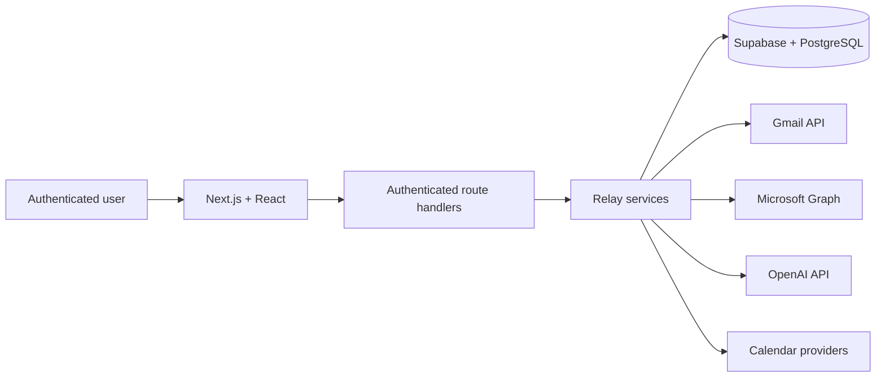
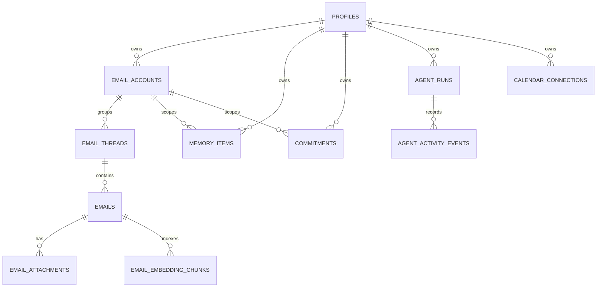

# Relay Capstone Defence — Slide Content and Production Design

## Document purpose

This is the production specification for Relay's final capstone defence deck. It separates **audience-facing slide copy** from **internal design, animation, and speaker direction** so production notes never appear in the delivered slides.

**Project:** Relay: AI-Assisted Email, Calendar, Memory, and Agent Platform  
**Course:** SED800 — Software Engineering Capstone  
**Defence:** Friday, August 14, 2026  
**Instructor:** Miguel Watler — miguel.watler@senecapolytechnic.ca

**Team**

- Dhruv Mann — dmann9@myseneca.ca
- Arshia Barootkoob Dezfooli — abarootkoob-dezfooli@myseneca.ca
- Smeet Brijesh Patel — spatel577@myseneca.ca
- Dipak Prasad Kushwaha — dkushwaha@myseneca.ca

The deck is designed for the first 10 minutes of the 25-minute defence, followed by a 7-minute live demonstration and 8 minutes of questions. The evidence baseline is the repository state and thesis verified on August 11, 2026.

> **Accuracy rule:** Do not describe generalized mailbox chat, automatic hybrid provider grounding, complete approval-gated model actions, penetration testing, production-scale performance, accessibility validation, or formal user outcomes as completed. These remain partial, targeted, or unverified.

---

## 1. Communication job and narrative

**Communication job:** By the end, the capstone panel should understand that Relay is a substantial, thoughtfully engineered multi-provider communication platform because the team can connect the business problem to defensible architecture, verified implementation evidence, clear security boundaries, and honest remaining work.

**Central takeaway:** Relay brings fragmented communication into one account-scoped workspace while keeping private context bounded, memory reviewable, and consequential authority outside the AI model.

**Narrative arc:** Fragmentation creates risk → Relay defines a controlled scope → the architecture preserves account ownership → the design evolved in response to evidence → implementation converts email into contextual, trackable work → tests verify the configured core → security boundaries define what can safely ship → the demo proves the end-to-end workflow → the panel evaluates the team's decisions.

### Defence timing

| Clock | Duration | Slides/activity | Rubric area |
| --- | ---: | --- | --- |
| 00:00–02:00 | 2:00 | Slides 1–3 | Business case and scope |
| 02:00–06:00 | 4:00 | Slides 4–8 | Design and alternatives |
| 06:00–09:00 | 3:00 | Slides 9–11 | Implementation, testing, and security |
| 09:00–10:00 | 1:00 | Slide 12 | Conclusion and future work |
| 10:00–17:00 | 7:00 | Slide 13 plus live product | Demonstration |
| 17:00–25:00 | 8:00 | Slide 14 | Questions and answers |

The title slide should already be visible before the clock starts. Slides 1–12 total exactly 10 minutes when rehearsed to the timings below.

---

## 2. Creative direction — “Signal in the Noise”

Relay's visual identity should make a complicated system feel calm, precise, and controlled. The recurring visual metaphor is a fine electric-blue signal travelling through layers of dark, fragmented communication and resolving into one clear path. The deck should feel editorial and architectural, not like a SaaS dashboard or a template marketplace deck.

### 2.1 Canvas and grid

- Format: 16:9, designed at 1920 × 1080.
- Safe margin: 96 px left/right and 72 px top/bottom.
- Grid: 12 columns, 24 px gutters, 8 px baseline rhythm.
- Default title position: x = 96 px, y = 72 px.
- Default title width: no more than 1,250 px; titles must never wrap unexpectedly.
- Keep the lower-right 8% visually quiet for the slide number and progress signal.
- Use asymmetry deliberately: most text occupies four to five columns and the hero visual occupies six to seven.

### 2.2 Colour system

| Role | Colour | Hex | Use |
| --- | --- | --- | --- |
| Ink | Near-black navy | `#07111F` | Primary background |
| Deep field | Blue-black | `#0B1728` | Secondary shapes and diagrams |
| Paper | Warm white | `#F4F1EA` | Primary text and light slides |
| Mist | Cool grey | `#AAB6C5` | Secondary text and diagram labels |
| Signal | Electric blue | `#5B8CFF` | Primary accent and active path |
| Mint | Soft mint | `#72E2C2` | Verified/implemented state |
| Amber | Warm amber | `#FFB86B` | Partial/open state and caution |
| Coral | Muted coral | `#FF7B7B` | Security blocker only |

Use one accent colour per argument. Blue establishes flow; mint means verified; amber means partial; coral is reserved for a genuine release blocker. Never use all accents simply for decoration.

### 2.3 Typography

- Preferred: **Söhne** or **Neue Haas Grotesk**. Practical fallback: **Inter**.
- Optional mono accent: **IBM Plex Mono** for timestamps, test counts, API names, and tiny diagram labels.
- Deck title: 64–72 pt, semibold, −2% tracking.
- Slide title: 40–48 pt, semibold, −1% tracking.
- Hero number: 104–144 pt, medium, tabular numerals.
- Subheading: 24–28 pt, medium.
- Body: 19–22 pt, regular, 1.25 line height.
- Footnote: 13–14 pt, medium; never smaller.
- Use sentence case. Avoid all-caps except tiny section labels of three words or fewer.
- Bold only the phrase carrying the claim. Do not bold whole bullets.

### 2.4 Texture, depth, and craft

- Apply 2% monochrome film grain over backgrounds. It should be felt, not seen.
- Add one restrained radial glow per slide: 20–30% opacity, 450–700 px diameter, heavily blurred, usually behind the main evidence.
- Use 1 px hairlines at 16–24% white opacity. Active paths are 2 px signal blue.
- Use soft shadows only on product screenshots: `0 24 70 / 24%` black, plus a 1 px white inner edge at 8% opacity.
- Standard corner radius: 18 px for screenshots; 10 px for small callouts. Avoid excessive rounded cards.
- Do not use glassmorphism panels, neon glows, gradient text, 3D icons, generic stock photos, or a logo wall.
- Crop screenshots to the feature being discussed. Remove browser chrome unless the URL itself is evidence.
- Add a faint topographic/thread texture on section-opening slides: thin, irregular parallel lines at 3–5% opacity, masked so they disappear behind text.
- Optical alignment matters: align type to letterforms, not only bounding boxes; keep diagrams centred by visual weight; use consistent label baselines.

### 2.5 Persistent deck chrome

- Top-left: tiny section label in IBM Plex Mono, 13 pt, mist, e.g. `01 / CASE`.
- Bottom-right: slide number in 13 pt mist.
- Bottom edge: a 2 px progress line. Completed segments are blue at 65% opacity; remaining segments are white at 10%.
- The Relay wordmark appears only on Slides 1, 13, and 14. Do not stamp it on every slide.

---

## 3. Motion language

The animation should feel expensive because it is controlled, synchronized, and meaningful. It should never compete with a speaker.

### 3.1 Global motion rules

- Default object entrance: **Fade + 12 px upward movement**, 0.42 seconds, ease-out.
- Default stagger: 0.08–0.12 seconds between related elements.
- Diagram paths: **Wipe from origin**, 0.50–0.70 seconds.
- Hero number: opacity 0→100 and scale 98→100%, 0.55 seconds.
- Slide transition: **Morph/Match Move** when an object continues into the next slide; otherwise **Fade**, 0.45 seconds.
- Use “After Previous” for decorative layers and “On Click” only when the reveal controls the spoken argument.
- Maximum animated travel: 24 px. No bounce, spin, elastic easing, zoom-through, confetti, or object-by-object letter animation.
- No more than three animation beats per slide, excluding subtle path drawing.
- Hold the finished composition for at least two seconds before advancing.

### 3.2 Recommended easing

- Entrance: cubic-bezier `(0.22, 1, 0.36, 1)`.
- Exit: cubic-bezier `(0.4, 0, 1, 1)`.
- Morphing diagrams: cubic-bezier `(0.65, 0, 0.35, 1)`.
- Ambient loops, if used, must be slower than 12 seconds and move no more than 6 px. Disable them during Q&A.

### 3.3 Reduced-motion version

Create a second export with all object motion replaced by 0.25-second fades. Preserve reveal order through builds, but remove travel, scale, line tracing, and ambient loops. The deck must remain fully understandable as a static PDF.

---

# 4. Slide-by-slide production specification

## Slide 1 — Relay

**Timing:** 00:00–00:20  
**Narrative job:** Establish the product and the governing idea of user control.  
**Section label:** `00 / RELAY`

### Audience-facing copy

> # Relay
> **One workspace for email, context, and follow-through.**
>
> Gmail · Outlook · AI assistance · Calendar · Memory

Small footer:

> Dhruv Mann · Arshia Barootkoob Dezfooli · Smeet Brijesh Patel · Dipak Prasad Kushwaha

### Composition

- Dark ink background.
- Place the title in the left 42% of the canvas, vertically centred slightly above the midpoint.
- On the right, create an abstract “relay signal”: four thin fragmented thread lines converge into one bright blue path, pass through a small circular node, then continue cleanly to the edge.
- The product descriptor sits beneath the title at 26 pt. Keep the technology line at 15 pt and 60% opacity.
- Team names sit at the bottom-left in a single line. Do not add emails to the visible slide.

### Visual craft

- Use a low-opacity topographic texture across the right half only.
- Add a blue radial glow behind the convergence node, 24% opacity.
- The node should be 14 px with a 2 px blue ring and warm-white centre—not a large glowing orb.
- Give the title one subtle detail: a 2 px blue baseline that begins under the “R” and extends 84 px.

### Animation choreography

1. **0.00–0.45 s:** Title and descriptor fade upward together.
2. **0.15–0.90 s:** Fragmented lines wipe in from four different origins and converge. The clean outbound signal draws last.
3. **0.65–1.05 s:** Technology line and team names fade in at 70% opacity.

Use a 0.55-second Morph transition to Slide 2: the clean signal line should continue into Slide 2 and become the horizontal timeline of fragmented work.

### Speaker cue

“Relay is a unified communication workspace for people whose important work is spread across inboxes, conversations, calendars, and follow-ups.”

### Production QA

- The title must remain the only dominant element.
- Do not add a Seneca logo unless required by the course template.
- Ensure every name fits on one line; use 14 pt if necessary, never smaller.

---

## Slide 2 — Email is no longer one inbox

**Timing:** 00:20–01:05  
**Narrative job:** Make fragmentation—not email volume—the core problem.  
**Section label:** `01 / PROBLEM`

### Audience-facing copy

> # Email is no longer one inbox.
>
> **A request arrives in one account.**  
> Its context lives in another thread.  
> The deadline becomes a calendar event—if someone remembers.

Bottom conclusion:

> Fragmentation creates missed context, missed commitments, and unsafe shortcuts.

### Composition

- Use a horizontal story across the centre: three isolated fragments labelled `REQUEST`, `CONTEXT`, and `DEADLINE`.
- Each fragment uses a different silhouette—not three matching cards:
  - an email subject line crop,
  - a thread excerpt with a faded earlier reply,
  - a calendar date marker.
- Separate the fragments with 140–180 px of negative space. A broken blue line runs behind them but does not yet connect.
- Place the conclusion as a full-width line near the bottom, separated by a 1 px hairline.

### Visual craft

- Keep fragment backgrounds deep field blue with slight tonal differences.
- Blur/redact all illustrative message text except the single useful words: “Can you confirm…”, “Earlier decision”, and “Friday 2:00”. These are synthetic examples, not performance evidence.
- Add a soft amber halo behind the deadline marker to indicate risk, not error.
- Use a paper-white cursor-sized dot near each fragment to imply attention switching.

### Animation choreography

1. **Beat 1, on click:** Request fragment fades in; the title is already present.
2. **Beat 2, after 0.10 s:** Context and deadline fragments appear sequentially, each with a restrained 16 px horizontal drift from its nearest edge.
3. **Beat 3, with speaker's conclusion:** The broken line tries to connect but stops in the gaps; the bottom conclusion fades in and the deadline halo pulses once from 20% to 32% opacity.

Transition to Slide 3 with a 0.45-second Fade. Do not animate the pulse continuously.

### Speaker cue

“The problem is not simply too much email. It is that the evidence, decision, and follow-up are split across systems, so people reconstruct the workflow manually.”

### Production QA

- The fragments should feel like editorial evidence, not clickable UI cards.
- Keep total visible body copy below 35 words excluding labels.
- The broken connection must be obvious in the static PDF.

---

## Slide 3 — Relay unifies the workflow without erasing control

**Timing:** 01:05–02:00  
**Narrative job:** Define the value proposition, implemented scope, and honest boundary.  
**Section label:** `01 / SCOPE`

### Audience-facing copy

> # Relay unifies the workflow without erasing control.

Three verbs across the slide:

> **Connect**  
> Gmail and Outlook

> **Understand**  
> Summaries, drafts, search, and context

> **Follow through**  
> Commitments, calendar, memory, and activity

Bottom boundary:

> **Not claimed:** production-scale performance, guaranteed AI correctness, completed penetration testing, or formal user-study results.

### Composition

- Use a warm-paper background for the first visual reset of the deck.
- The three verbs sit on one shared baseline, not inside cards. Place a thin, continuous blue line through all three columns to show one workflow.
- Each column gets one native line illustration: linked accounts, a contextual thread, and a calendar check.
- Put the boundary statement in a narrow ink strip across the bottom 19% of the slide.

### Visual craft

- Text is ink on paper; blue is the only accent in the main field.
- Illustrations are 1.5 px line art with rounded ends. Avoid icon-library symbols that look mismatched.
- Use tiny mint endpoint dots for implemented functions.
- In the bottom strip, “Not claimed” is amber; the rest is mist.

### Animation choreography

1. **0.00–0.45 s:** Background crossfades from dark to paper; title fades in.
2. **On click:** The connecting line wipes left-to-right. Each verb and illustration appears as the line reaches it, with 0.10-second stagger.
3. **With final sentence:** The bottom boundary strip rises 18 px and settles with no overshoot.

Use Morph to Slide 4: the single horizontal line rotates/reconfigures into the central Relay service spine.

### Speaker cue

“Our scope connects two providers, adds contextual assistance, and turns communication into explicit follow-through. We also separate what is implemented from what still needs production evidence.”

### Production QA

- The “Not claimed” boundary must remain readable but secondary.
- Do not list every feature. The three verbs are the memory structure.
- Confirm the first three slides rehearse to exactly 2:00.

---

## Slide 4 — One authenticated boundary connects four external systems

**Timing:** 02:00–02:55  
**Narrative job:** Explain the high-level architecture and trust boundary.  
**Section label:** `02 / ARCHITECTURE`

### Audience-facing copy

> # One authenticated boundary connects four external systems.

Footer statement:

> Secrets, provider tokens, service-role credentials, and model keys remain server-side.

### Composition

- Return to the ink background.
- Build the architecture as a wide left-to-right pipeline with Relay services as the central, visually dominant spine.
- Put Supabase below the spine and external providers in a controlled fan-out to the right.
- Draw a faint rounded rectangular trust boundary around the route handlers, Relay services, and database. Label it `SERVER TRUST BOUNDARY` above the stroke.
- Keep the user and UI outside the boundary on the left; providers remain outside it on the right.

### Visual craft

- Use typography and lines rather than logo tiles. Provider names are enough.
- Main request path: blue 2 px. Database ownership path: mint 2 px. External provider paths: mist 1.5 px until active.
- The trust boundary uses a dotted 1 px white line at 24% opacity.
- Add one small shield notch at the API boundary; avoid a large generic shield icon.

### Animation choreography

1. **Beat 1:** User → UI → route handlers draws in 0.70 seconds.
2. **Beat 2:** The trust boundary appears, then route handlers → Relay services → database draws; the database endpoint turns mint.
3. **Beat 3:** Provider paths fan out with a 0.08-second stagger. The server-side footer fades in last.

Use a 0.50-second Morph transition to Slide 5. Keep the central Relay spine fixed while the surrounding architecture transforms into a “planned versus delivered” comparison.

### Speaker cue

“Every request crosses one authenticated server boundary. The server resolves the user and account before shared services access Relay data or an external provider; the browser never receives sensitive service credentials.”

### Production QA

- Ensure the architecture remains legible from the back of a classroom.
- Minimum node label 18 pt.
- Do not imply that RLS replaces route-level ownership checks; both are part of the design.

---

## Slide 5 — The design changed where implementation evidence demanded it

**Timing:** 02:55–03:45  
**Narrative job:** Demonstrate design evolution rather than hiding deviations from the plan.  
**Section label:** `02 / EVOLUTION`

### Audience-facing copy

> # The design changed where implementation evidence demanded it.

| Original plan | End product |
| --- | --- |
| React SPA + Express API | Next.js backend-for-frontend + modular services |
| Webhook-first synchronization | Gmail history and Outlook delta pulls |
| OpenAI or Anthropic | OpenAI as the implemented model provider |
| Unified FTS + vector RAG | Provider search + scoped semantic context |
| Generic agent proposals | Calendar, commitments, briefs, and activity first |

Bottom takeaway:

> The business goal remained stable; architecture and claims became more precise.

### Composition

- Use two vertical fields separated by a fine centre line: “Original plan” on deep field blue and “End product” on ink.
- Each original item aligns horizontally with its evolved counterpart. Use no boxed table borders.
- Place a small directional chevron or flowing line between paired items.
- Make the bottom takeaway span both fields.

### Visual craft

- Original-plan copy is mist at 70% opacity; end-product copy is paper at 100%.
- Use amber dots on partial end-state items (`scoped semantic context`, `activity first`) and mint dots on implemented structural changes.
- Add a faint blueprint grid only behind the original-plan side; the delivered side is visually cleaner.

### Animation choreography

1. **Beat 1:** Original-plan column appears as a single unit at 80% opacity.
2. **Beat 2:** Each pair transforms left-to-right using Morph/Match Move, 0.18 seconds apart. Avoid animating individual words.
3. **Beat 3:** The centre line brightens blue and the bottom takeaway fades in.

Transition to Slide 6 with a 0.45-second Fade.

### Speaker cue

“The requirements did not disappear when the implementation changed. We kept the original baseline and recorded how the final system evolved, including partial requirements instead of re-labelling them as complete.”

### Production QA

- Five rows are the maximum. Use the thesis for detail.
- Maintain strict row alignment so comparison is instantaneous.
- Do not use “before/after” imagery that implies the original design was careless; this is evidence-led evolution.

---

## Slide 6 — Ownership is the backbone of the data model

**Timing:** 03:45–04:30  
**Narrative job:** Show the core ER design and explain multi-user/multi-account isolation.  
**Section label:** `02 / DATA MODEL`

### Audience-facing copy

> # Ownership is the backbone of the data model.

Right-side callout:

> **User → account → evidence → action**  
> Ownership is explicit at every consequential boundary.

### Composition

- Use a simplified constellation-style ER diagram occupying the left 68%.
- Put `PROFILES` at the visual root. Arrange four branches by domain: mail, memory, commitments, and activity/calendar.
- Use the right 25% for the callout and a tiny legend: mint = ownership; blue = operational relationship.
- The full formal ER diagram stays in the thesis/design document; this slide is intentionally simplified.

### Visual craft

- Entities are flat text labels with a short underline—not rounded cards.
- Ownership connectors are mint; domain connectors are blue-grey.
- Use 18 pt entity labels and 13 pt relationship labels.
- Add a 4% grain texture that is slightly denser around external edges and clearer around `PROFILES`.

### Animation choreography

1. **Beat 1:** `PROFILES` appears with a soft mint ring.
2. **Beat 2:** Ownership branches draw outward simultaneously over 0.65 seconds; domain entities fade in as each path arrives.
3. **Beat 3:** The right-side statement appears and the words “evidence” and “action” briefly change from mist to paper.

Use Morph to Slide 7: the mail branch (`EMAIL_THREADS → EMAILS → EMAIL_EMBEDDING_CHUNKS`) expands into the context pipeline.

### Speaker cue

“The schema makes ownership explicit. A profile owns accounts and user-created data; messages and workflow records inherit or carry account scope so the server and RLS can enforce separation.”

### Production QA

- If Mermaid rendering becomes too dense, redraw natively using the same relationships.
- Never show every database table on this slide.
- Make clear that service-role routes must still authenticate and filter ownership even when RLS exists.

---

## Slide 7 — Context improves answers only when its boundaries stay visible

**Timing:** 04:30–05:15  
**Narrative job:** Explain the implemented contextual AI path and its limitation.  
**Section label:** `02 / CONTEXT`

### Audience-facing copy

> # Context improves answers only when its boundaries stay visible.

Context inputs:

> **Exact selected thread**  
> Account preferences  
> Accepted memory  
> Same-contact sent mail  
> User-scoped semantic matches

Output:

> **Structured answer, summary, draft, or brief**

Boundary note:

> Generalized hybrid re-fetch and automatic provider fallback remain incomplete.

### Composition

- Create one visual funnel from five context strands on the left into a narrow “Relay context boundary” in the centre, then one clean output on the right.
- The selected thread is the thickest strand and labelled `SOURCE EVIDENCE`.
- Memory and semantic context are thinner and labelled `SUPPORTING CONTEXT`.
- Put the limitation note beneath the funnel, aligned to the centre boundary.

### Visual craft

- Exact provider evidence: warm white.
- Accepted memory: mint.
- Semantic matches: blue with a dotted texture, visually signalling relevance rather than truth.
- Untrusted provider text crosses a small striped zone before entering the prompt boundary.
- Avoid an AI brain, sparkles, or magic-wand imagery.

### Animation choreography

1. **Beat 1:** The exact selected-thread strand enters first and holds.
2. **Beat 2:** Supporting strands arrive with 0.08-second stagger; the context boundary closes around them.
3. **Beat 3:** The output line wipes to the right and the structured output appears. The incomplete-boundary note fades in with amber marker.

Transition to Slide 8 with a 0.50-second Morph: the output line becomes the workflow state line.

### Speaker cue

“Relay uses the selected thread as direct evidence and adds bounded preferences, accepted memory, sent-mail history, and semantic context. Those sources improve relevance, but similarity is not source truth, and generalized automatic re-fetch remains future work.”

### Production QA

- The limitation note must be visible without dominating the slide.
- Never claim that every semantic match is re-fetched from Gmail or Outlook in the current baseline.
- Keep the distinction between evidence and personalization visually obvious.

---

## Slide 8 — Useful automation needs a stop line

**Timing:** 05:15–06:00  
**Narrative job:** Separate current user-directed workflows from the target approval executor.  
**Section label:** `02 / AUTHORITY`

### Audience-facing copy

> # Useful automation needs a stop line.

**Implemented now**

> User-owned activity · scheduling · cancel/retry · authenticated email and calendar routes

**Required before model-proposed writes**

> Immutable proposal → explicit approval → atomic claim → server revalidation → execution

Bottom statement:

> A model proposal is not authorization.

### Composition

- The centre of the slide is a single left-to-right state line.
- The implemented segment occupies the left 55% in mint/blue.
- Insert a bright vertical stop line labelled `AUTHORIZATION BOUNDARY`.
- The target segment sits to the right in an amber dashed style.
- The bottom statement is large—32 pt—and isolated with generous negative space.

### Visual craft

- Make the authorization boundary a 2 px warm-white line with a compact lock-notch shape at its top.
- Current states are filled circles; target states are outlined circles.
- Use no red on this slide: incomplete work is not a failure. Amber communicates guarded status.
- A faint email-text texture stops physically at the authorization line to reinforce that content cannot grant permission.

### Animation choreography

1. **Beat 1:** Implemented state line draws to the authorization boundary, then stops sharply.
2. **Beat 2, on click:** The vertical boundary appears from top to bottom; the bottom statement fades in immediately.
3. **Beat 3:** Target states appear as an amber dashed preview—no motion crosses into the execution state.

Use a hard 0.25-second Dip-to-Black or a disciplined 0.40-second Fade into Slide 9. This is the only slightly sharper section transition in the deck.

### Speaker cue

“The current system records user-owned activity and supports authenticated user-directed actions. The generalized immutable approval executor is not complete, so consequential model-proposed writes must remain disabled until approval and server revalidation exist.”

### Production QA

- The static slide must make “implemented” versus “required” unmistakable.
- Never place “complete approval-gated model actions” in the results column.
- Rehearse this wording exactly; it is a likely panel question.

---

## Slide 9 — The implementation is modular where change is most likely

**Timing:** 06:00–06:45  
**Narrative job:** Connect architecture decisions to concrete implementation.  
**Section label:** `03 / IMPLEMENTATION`

### Audience-facing copy

> # The implementation is modular where change is most likely.

> **Experience**  
> Next.js 16 · React 19 · TypeScript · Tailwind

> **Application**  
> Authenticated route handlers · Zod validation · server services

> **Data**  
> Supabase Auth · PostgreSQL · RLS · pgvector

> **Integrations**  
> Gmail · Microsoft Graph · OpenAI · Google/Microsoft calendars

### Composition

- Build four horizontal layers, each spanning about 74% of the slide.
- Vary widths slightly so the silhouette feels architectural, not like four identical cards.
- Place one vertical blue “request spine” through all layers at x ≈ 1,420 px; short labels attach to it: `authenticate`, `validate`, `scope`, `integrate`.
- Use a small repository/module strip at the bottom with example module families, not file paths.

### Visual craft

- Each layer uses only a hairline divider and typography; no filled boxes.
- Highlight the changing seams—provider adapters, model integration, and schemas—with blue ticks.
- Use IBM Plex Mono for technology names at 15 pt, with 110% tracking.
- Add one soft blue glow behind the application/data boundary.

### Animation choreography

1. **Beat 1:** The request spine draws top-to-bottom.
2. **Beat 2:** Layers appear in execution order: experience, application, data, integrations, 0.10 seconds apart.
3. **Beat 3:** Blue seam ticks illuminate where provider/model implementations can change without redesigning the interface.

Transition to Slide 10 with Morph: the four layers compress into four coverage metrics.

### Speaker cue

“The application is a modular monolith: one deployment boundary, with separate UI, authenticated routes, schemas, services, provider adapters, and data concerns. That keeps the capstone operable while preserving extraction points if future scale justifies them.”

### Production QA

- Technology names are evidence, not the headline.
- Do not turn this into a logo wall.
- Do not imply the residual Express routes are part of the selected production trust model; mention them on the security slide.

---

## Slide 10 — Automated evidence is strong inside a defined scope

**Timing:** 06:45–07:50  
**Narrative job:** Present verified test results with the correct interpretation.  
**Section label:** `03 / TESTING`

### Audience-facing copy

> # Automated evidence is strong inside a defined scope.

Hero evidence:

> **206** tests passed  
> **36** Jest suites  
> **0** failures

Coverage rail:

> Statements **100%** · Branches **100%** · Functions **100%** · Lines **100%**

Footnote:

> Verified August 11, 2026. Coverage applies to the configured core-module instrumentation—not every repository file, live provider, deployment, or security property.

### Composition

- Use a paper background to signal evidence and clarity.
- Make `206` the hero number on the left. Stack `tests passed` beneath it.
- Place `36 suites` and `0 failures` as smaller evidence to the right, connected by one thin baseline.
- The four coverage metrics form a single horizontal rail near the bottom, not four doughnut charts.
- Put the scope footnote in a 15% ink band at the bottom.

### Visual craft

- Hero number in ink, mint baseline, no gradient.
- Coverage rail is mint from 0 to 100 with a hairline marker at 100. Because every metric is 100, avoid four identical charts.
- Include a small test-layer stack behind the numbers at 8% opacity: unit, component, integration, schema contract, performance regression.
- Use tabular numerals so all metrics align perfectly.

### Animation choreography

1. **Beat 1:** `206` fades/scales 98→100%; “tests passed” appears 0.12 seconds later.
2. **Beat 2:** `36 suites` and `0 failures` reveal together; the coverage rail wipes to 100% once.
3. **Beat 3, on the word “scope”:** The bottom footnote band fades in. Slightly dim the hero evidence to 92% so the qualification receives attention.

Transition to Slide 11 with a 0.45-second Fade.

### Speaker cue

“On August 11, 206 Jest tests in 36 suites passed, and the configured core-module coverage scope met all four 100% thresholds. That is meaningful repository evidence, but it is not proof of every file, live provider, production load, usability, or security.”

### Production QA

- Use the exact date and exact counts.
- Do not say “100% of the application is tested.”
- Keep the qualification on-screen for at least four seconds.

---

## Slide 11 — Security is layered—and release still has gates

**Timing:** 07:50–09:00  
**Narrative job:** Demonstrate implemented controls, open risks, and release discipline.  
**Section label:** `03 / SECURITY`

### Audience-facing copy

> # Security is layered—and release still has gates.

**Implemented controls**

> Authentication + server-owned account scope  
> RLS and schema-contract tests  
> AES-256-GCM token encryption  
> Input and structured-output validation  
> Untrusted-email boundary + bounded activity controls

**Release gates**

> Isolate legacy Express routes  
> Complete two-user deployed isolation tests  
> Validate headers, retention, attachments, and rate limits  
> Complete adversarial and penetration testing  
> Finish approval revalidation before model-proposed writes

### Composition

- Split the slide 58/42, but do not make symmetrical cards.
- On the left, show five concentric or nested defence layers around a small key/token glyph. Label each layer with the implemented controls.
- On the right, use a vertical release gate with five notches. Unverified gates are amber; critical blockers use coral only if the security plan classifies them as release-blocking.
- Add the sentence `Security plan ≠ penetration-test report` as a small but prominent footer.

### Visual craft

- Keep implemented controls mint/blue. Release gates are amber, with one coral marker for unresolved high-impact authorization/legacy-route risk.
- Use line textures that become tighter toward the protected token at the centre.
- Avoid padlock clip art. Use an abstract key silhouette built from the same line language as the deck.
- The left and right fields should share one baseline to feel like a single risk argument.

### Animation choreography

1. **Beat 1:** Defence layers build from inside out, 0.10 seconds apart.
2. **Beat 2, on click:** The release-gate line draws top-to-bottom. Each open notch appears at the relevant spoken item.
3. **Beat 3:** Footer statement fades in; the animation then stops completely for the final security sentence.

Use a 0.55-second Morph to Slide 12: the release-gate line becomes the three-step future-work path.

### Speaker cue

“Relay implements authentication, ownership checks, RLS, encrypted provider tokens, validation, and AI input boundaries. The security plan also identifies release gates; it is not a completed penetration-test report, and the system should not be presented as externally release-ready yet.”

### Production QA

- Ensure “implemented” and “release gates” are visually distinct.
- Avoid claiming security by coverage percentage.
- Do not expose real keys, account identifiers, tokens, logs, or private email in screenshots.

---

## Slide 12 — Relay proves the architecture; production readiness is the next test

**Timing:** 09:00–10:00  
**Narrative job:** Resolve the opening problem, summarize outcomes, and prioritize future work.  
**Section label:** `04 / CONCLUSION`

### Audience-facing copy

> # Relay proves the architecture; production readiness is the next test.

**What the project demonstrates**

> Multi-provider communication  
> Account-scoped contextual AI  
> Reviewable personalization memory  
> Calendar, commitments, and activity-tracked workflows  
> Strong automated evidence within a defined scope

**Next three priorities**

> **1** Close release-blocking security gaps  
> **2** Complete live browser, isolation, load, accessibility, and user evaluation  
> **3** Finish immutable approval execution and deepen source-backed personalization

Closing line:

> **Email becomes evidence. The user keeps authority.**

### Composition

- Use an ink background with a large, quiet blue arc moving from the bottom-left to the upper-right.
- Place demonstrated outcomes along the completed portion of the arc in mint.
- Place the three next priorities along the continuation in warm white/amber.
- The closing line sits alone at bottom-left in 30–34 pt, separated from the lists.

### Visual craft

- Reuse the convergence signal from Slide 1, now resolved into one continuous route.
- Add a tiny visual echo of the original three fragments—request, context, deadline—now aligned along the completed path.
- Keep future-work typography equal in dignity to results; honest limitations should not look like fine print.
- Make “user keeps authority” paper white, not blue, to signal it is the principle rather than a feature.

### Animation choreography

1. **Beat 1:** Completed outcomes appear along the arc as it draws in mint.
2. **Beat 2:** The arc continues in blue/amber; priorities appear in numeric order with 0.12-second stagger.
3. **Beat 3:** Everything dims to 82% except the closing line, which fades in and holds for two seconds.

Use Morph to Slide 13: the resolved signal becomes the demo progress path.

### Speaker cue

“Relay demonstrates a credible way to combine multi-provider communication, contextual assistance, reviewable memory, and trackable work. The next phase is not more feature volume; it is security closure, controlled evaluation, and completion of the approval boundary.”

### Production QA

- Do not end the argument with a generic “Thank you.”
- Rehearse Slides 1–12 to exactly 10:00.
- The closing line should be memorable without sounding like an unsupported marketing claim.

---

## Slide 13 — See the workflow in one continuous path

**Timing:** 10:00–17:00 while the live product is demonstrated  
**Narrative job:** Set expectations and provide a graceful visual return point if the demo pauses.  
**Section label:** `05 / LIVE DEMO`

### Audience-facing copy

> # See the workflow in one continuous path.

> **1 Connect** → **2 Triage** → **3 Understand** → **4 Remember** → **5 Follow through** → **6 Verify activity**

Small line:

> Synthetic Gmail and Outlook accounts · No personal data

### Composition

- Use a full-bleed, carefully cropped Relay screenshot with the interface slightly blurred and darkened to 42%.
- Overlay one horizontal six-step path. The active step is paper white with a blue underline; future steps are mist.
- Keep a small QR-code-sized blank area in the lower-left only if a deployment URL is confirmed. Otherwise omit it entirely.
- When switching to the browser, leave this slide accessible as the fallback visual.

### Visual craft

- Mask or remove every personal identifier in the screenshot.
- Apply a 12 px blur only to the background screenshot, never the overlay text.
- Use one blue spotlight gradient behind the currently active demo step.
- Keep the demo machine's desktop, browser theme, and product theme consistent with the deck.

### Animation choreography

1. **Initial:** The six-step path wipes in left-to-right over 0.80 seconds.
2. **During demo:** If the presentation tool supports sections, advance the blue underline between steps using Morph. Do not return to the deck for every step if it interrupts the live flow.
3. **On demo completion:** The final `Verify activity` step turns mint and the entire path holds for one second before moving to Q&A.

Use a 0.45-second Fade to Slide 14.

### Speaker cue and exact seven-minute flow

| Clock | Action | Evidence to show |
| --- | --- | --- |
| 10:00–10:45 | Connect | Gmail, Outlook, and combined account scope |
| 10:45–11:45 | Triage | Unified inbox, thread, participants, history, and standard actions |
| 11:45–13:00 | Understand | Summary, next action, context sources, and an unsent draft |
| 13:00–14:15 | Remember | Selected-thread context and memory inspection/correction |
| 14:15–15:15 | Follow through | Commitment or calendar workflow based on synthetic evidence |
| 15:15–16:30 | Verify activity | Activity record, eligible cancellation/retry, and current authorization boundary |
| 16:30–17:00 | Close | Multi-provider context, reviewable memory, and bounded authority |

### Demo backup design

- Prepare six 1920 × 1080 fallback screenshots matching the six steps.
- Add the same blue progress line to every screenshot so the fallback still feels like one story.
- Prepare a seven-minute local MP4 using hard cuts between actions and 0.25-second dissolves only for waiting states.
- Place a discreet `RECORDED BACKUP` label in the upper-right if the video is used; never pretend it is live.
- If OpenAI is slow, show a saved response with visible source categories and explain the limitation.
- If one provider fails, continue with the other and use the labelled backup capture for provider abstraction.

### Production QA

- Use only synthetic messages and test accounts.
- Hide notifications, bookmarks, personal avatars, browser extensions, environment files, consoles, and secrets.
- Increase browser zoom to 110–125% so important controls are legible from the room.

---

## Slide 14 — The decisions are open for examination

**Timing:** 17:00–25:00  
**Narrative job:** Invite rigorous questions while keeping the project's strongest themes visible.  
**Section label:** `06 / DEFENCE`

### Audience-facing copy

> # The decisions are open for examination.

> Architecture · Alternatives · Testing · Security · AI reliability · Privacy · Team process

Bottom-left:

> **Relay**  
> Email becomes evidence. The user keeps authority.

Bottom-right:

> Dhruv · Arshia · Smeet · Dipak

### Composition

- Return to the minimal Slide 1 composition.
- The four fragmented lines are now one stable network with four subtle branch points, representing the four team members.
- Put the topic line below the title with generous spacing; it gives the panel productive entry points.
- Keep the centre-right open so a presenter can stand without blocking essential text.

### Visual craft

- Deep ink background, 2% grain, low blue glow.
- The network is static during Q&A. No ambient loop; motion behind a speaker becomes distracting.
- Give the title a short paper-white underline rather than blue, signalling the deck has moved from presentation to examination.

### Animation choreography

1. Title fades in over 0.35 seconds.
2. Topic line appears as one unit, not seven separate animations.
3. Team names and Relay closing line fade in together. All motion then stops.

### Q&A response pattern

Each answer should follow a concise four-part structure:

1. **Decision:** State what the team chose.
2. **Reason:** Explain the requirement or trade-off.
3. **Evidence:** Point to implementation, test, schema, or documented design evidence.
4. **Boundary:** State the limitation or next validation honestly.

### Likely ownership by topic

| Topic | Suggested lead | Supporting angle |
| --- | --- | --- |
| Business case, scope, project planning | Dhruv Mann | Requirements evolution, timing, verified results |
| Context, retrieval, memory, AI reliability | Arshia Barootkoob Dezfooli | Evidence boundaries, hallucination limits, prompt injection |
| Interface and demonstration | Smeet Brijesh Patel | User workflow, responsive design, accessibility limitations |
| Data design, RLS, security, privacy | Dipak Prasad Kushwaha | Ownership, encryption, risk evidence, release gates |

Every member should be able to explain the entire architecture and give two verified personal contributions with repository evidence.

---

# 5. Visual asset production list

Create these assets before assembling the final deck:

1. **Relay signal motif:** editable vector lines, one fragmented version and one resolved version.
2. **Thread texture:** original vector contour pattern at 1920 × 1080, 3–5% opacity.
3. **Architecture diagram:** native editable shapes; Mermaid is the content blueprint, not necessarily the final rendering.
4. **Simplified ER constellation:** editable vector connectors with mint ownership paths.
5. **Context funnel:** five source strands, striped untrusted-data zone, and structured output.
6. **Authorization stop line:** current solid state, boundary, and target dashed state.
7. **Coverage rail:** tabular numerals and a single 100% measurement line.
8. **Security layers/release gate:** one integrated illustration rather than two disconnected icon lists.
9. **Six synthetic demo screenshots:** account scope, inbox/thread, AI response, memory, commitment/calendar, and activity result.
10. **Seven-minute fallback video:** local playback tested without internet.

All screenshots should use the same seeded synthetic scenario so the audience follows one person, one request, one deadline, and one outcome rather than six unrelated examples.

---

# 6. Transition and animation map

| From → to | Transition | Duration | Narrative reason |
| --- | --- | ---: | --- |
| 1 → 2 | Morph | 0.55 s | Unified signal becomes fragmented work timeline |
| 2 → 3 | Fade | 0.45 s | Move from problem to solution definition |
| 3 → 4 | Morph | 0.55 s | Unified workflow line becomes architecture spine |
| 4 → 5 | Morph | 0.50 s | Architecture becomes planned-versus-delivered evolution |
| 5 → 6 | Fade | 0.45 s | Shift from evolution to data evidence |
| 6 → 7 | Morph | 0.50 s | Mail entities expand into context flow |
| 7 → 8 | Morph | 0.50 s | AI output path becomes workflow authority line |
| 8 → 9 | Fade/dip | 0.40 s | Close design argument; begin implementation evidence |
| 9 → 10 | Morph | 0.50 s | Implementation layers compress into test metrics |
| 10 → 11 | Fade | 0.45 s | Move from quality evidence to security boundaries |
| 11 → 12 | Morph | 0.55 s | Release gate becomes future-work path |
| 12 → 13 | Morph | 0.55 s | Resolved signal becomes demo progress path |
| 13 → 14 | Fade | 0.45 s | Move from product evidence to panel examination |

If Morph is unavailable, use a 0.35-second Fade and preserve object positions. Do not substitute dramatic cube, flip, gallery, or zoom transitions.

---

# 7. Final production checklist

## Content integrity

- [ ] Slides 1–3 cover the business case, value, stakeholders, implemented scope, and exclusions.
- [ ] Slides 4–8 cover architecture, alternatives, data design/ER relationships, evolution, contextual AI, and the target approval boundary.
- [ ] Slide 9 accurately describes the implemented stack without treating legacy Express routes as the selected final architecture.
- [ ] Slide 10 states exactly 36 Jest suites, 206 passed tests, zero failures, and 100% within the configured core-module scope, verified August 11, 2026.
- [ ] Slide 11 separates implemented controls from planned/manual security evidence.
- [ ] Slide 12 does not list complete approval-gated model actions as an achieved result.
- [ ] Slides 13–14 support the live demo and individual defence questions.
- [ ] Every screenshot uses synthetic data and every quantitative claim is repository-backed.

## Visual quality

- [ ] Every slide has one dominant claim and one dominant visual.
- [ ] No title wraps; body type is at least 19 pt; footnotes are at least 13 pt.
- [ ] Alignment follows the 12-column grid and the 8 px baseline.
- [ ] Decorative grain remains below 3% on light slides and 5% on dark slides.
- [ ] Contrast meets WCAG AA for all essential text.
- [ ] Colour is never the only indicator of implemented, partial, or target status.
- [ ] Product screenshots are cropped, legible, consistent, and free of personal information.
- [ ] Mermaid diagrams are either rendered correctly or rebuilt as native editable shapes.

## Motion quality

- [ ] Every animation supports reveal order, causality, comparison, or state change.
- [ ] No slide has more than three main animation beats.
- [ ] No bounce, spin, elastic motion, dramatic zoom, or continuous distraction is used.
- [ ] Slides remain understandable as static PDF pages.
- [ ] A reduced-motion deck has been exported using fades only.
- [ ] The presentation has been tested on the actual defence computer and projector.

## Rehearsal and delivery

- [ ] Slides 1–12 total 10:00 without rushing.
- [ ] The demo totals 7:00 and uses a single seeded story.
- [ ] Q&A answers follow decision → reason → evidence → boundary.
- [ ] Each member can explain the full architecture and two personal contributions.
- [ ] The local backup MP4 and screenshots open without network access.
- [ ] Notifications, secrets, personal accounts, and developer consoles are hidden.

---

## Recommended final feel

The deck should not look “expensive” because it contains more effects. It should feel expensive because every choice is deliberate: the same signal motif carries the story, the visual hierarchy never wavers, evidence receives space, limitations are designed with the same care as achievements, and motion reveals the system's logic at exactly the moment the speaker explains it.
